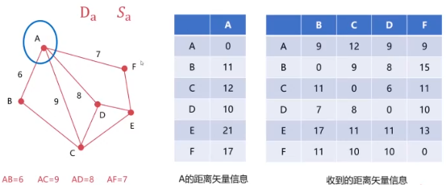
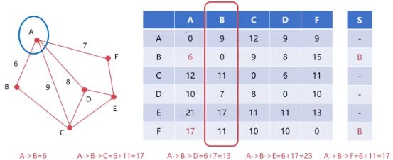
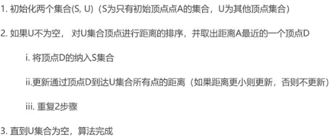
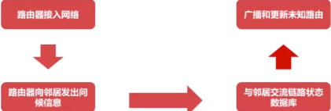

## 1. 网络层的路由

### 1.1. 网络层的路由概述

下一跳地址是怎么来的，是唯一的吗，是最佳的吗，路由器怎么协同工作的？


现实中的**网络拓扑**可以**抽象成图**：
- [ ] 每个**顶点**表示**一个网络、路由器或计算机**
- [ ] 每一条**边**表示**一条网络路径**

**路由算法**实际上是**图论的算法**
- [ ] 网络环境复杂，抖动，因此路由算法比图论算法复杂


#### 1.1.1. 自治系统AS（`Autonomous System`）
- [ ] 一个自治系统是处于一个管理机构下的网络设备群（管理机构可以看做国家、地区、家庭、公司，有不同级别）
- [ ] **AS内部网络自行管理，AS对外提供一个或者多个出入口**

分类：
- [ ] 自治系统内部路由的协议称为：内部网关协议（`RIP`、`OSPF`）
- [ ] 自治系统外部路由的协议称为：外部网关协议（`BGP`）
 


### 1.2. 内部网关路由协议之RIP协议

距离矢量（DV）算法：
- [ ] 每一个节点使用两个向量`Di`和`Si`
- [ ] `Di`描述的是当前节点到别的节点的距离
- [ ] `Si`描述的是当前节点到别的节点的下一个节点


具体：
- [ ] 每一个节点与**相邻的节点**交换向量`Di`和`Si`的信息
- [ ] 每一个节点根据交换的信息**更新自己的节点信息**


目的是求`dij `的最小值
```
dij = min（dix + dxj）
```

以节点A为例，A到B的距离与B到A的距离不一样的原因是路径不同：



由于A和B直接通信，可以知道它们之间距离为6，进而通过B的交换信息，可以知道经过B，A到其他点的距离：

 


得到这些距离矢量后，就会把它们和自己的距离矢量比较，如果比自己距离矢量小的话，就会把它填充到自己的距离矢量里面去，并把S向量的对应位置写成B


 


同理，A和C交换信息如下：

 


#### 1.2.1. RIP协议：
- [ ] RIP（`Routing Information Protocol`）协议
- [ ] RIP协议是使用DV算法的一种路由协议

基本：
- [ ] RIP协议把网络的跳数（hop）作为DV算法的距离
- [ ] RIP协议每隔30s交换一次路由信息
- [ ] RIP协议认为跳数>15的路由则为不可达路由


过程：
- [ ] 路由器初始化路由信息（两个向量Di和Si）
- [ ] 对相邻路由器X发过来的信息，对信息的内容进行修改（下一跳地址设置为X，所有距离加1）
  - 检索本地路由，将信息中新的路由插入到路由表里面
  - 检索本地路由，对于下一跳为X的，更新为修改后的信息
  - 检索本地路由，对比相同目的的距离，如果新信息的距离更小，则更新本地路由表 
- [ ] 如果三分钟没有收到相邻的路由信息，则把路由设置为不可达（16跳）


①插入的新的下一跳，左图表示达到D的距离是2，下一跳地址是A：


 
在我前面的人告诉我，他距离下一个目标有多远，我把他当做下一跳地址记下来，并把他到下一个目标距离加1，作为我到下一目标的距离


②把旧的信息替换成新的：

 


③DV算法

 


故障信息传递慢
- [ ]  随便相信“隔壁老王”
- [ ]  “自己不思考”、“视野不够”


### 1.3. Dijkstra（迪杰斯塔拉）算法

- [ ] 解决有权图从**一个节点到其他节点的最短路径问题**
- [ ] 以起始点为中心，向外层层层扩展





知道离自己相邻的人的距离，不断地找到**距离自己最小的人D**，将其纳入S，计算通过D到图中所有点的距离(**A到D加上D到X**)，**如果小于之前记录的距离就更新**


### 1.4. 内部网关路由协议之OSPF协议

链路状态（LS）协议：
- [ ] 向**所有**路由器发送信息（**一传十十传百**，**只和相邻的路由器交换信息**）
- [ ] 消息描述该路由器与相邻路由器的**链路状态**（距离、时延、带宽，网络管理员可以介入，“代价”，RIP协议交换的只是**跳数**）
- [ ] 只有链路状态发送变化时，才发送更新信息（**RIP每隔30s**交换路由信息）


OSRF（`Open Shortest Path First`）开放最短路径优先
- [ ] 核心是`Dijkstra`算法
- [ ] 获得网络中的所有信息=>**网络的完整拓扑**（也称为**链路状态数据库**，它**全网一致**）
- [ ] OSRF更加客观，更加先进，因为它使用链路状态来描述连接质量，不仅仅是跳数
- [ ] 减少了数据的交换，更快收敛（状态变化才发送信息）


五种信息类型：
- [ ] 问候消息（hello）
- [ ] 链路状态数据库描述信息
- [ ] 链路状态请求信息
- [ ] 链路状态更新信息（频繁，最常见）
- [ ] 链路状态确认信息


先向邻居发送hello，再与其交流链路状态数据库，广播和更新未知路由




`RIP`和`OSRF`对比：
|RIP协议|OSRF协议|
|---|---|
|从邻居看网络|整个网络的拓扑|
|在路由器之间累加距离|Dijkstra算法计算最短路径|
|频繁、周期更新，收敛很慢|状态变化更新，收敛很快|
|路由间拷贝路由信息|路由间传递链路状态，自行计算路径|


### 1.5. 外部网关路由协议之BGP协议

- [ ] BGP（`Boder Gateway Protocal`:边际网关协议）
- [ ] 运行在自治系统（AS）之前的协议


使用它的原因
- [ ] 互联网的规模很大（用OSRF的话链路状态数据库会很大，更新频繁）
- [ ] AS内部使用不同的路由协议
- [ ] AS之间需要考虑除网络特性以外的一些因素（政治、安全）
BGP协议能找到一条到达目的比较好的路由（OSRF和RIP都是最好的路径）


BGP发言人（`speaker`）
- [ ] BGP并不关系内部网络拓扑
- [ ] AS之间通过BGP发言人交流信息
- [ ] BGP可以人为配置策略

