- [1. 数据结构与算法](#1-数据结构与算法)
  - [1.1. 复杂度](#11-复杂度)
    - [1.1.1. `log`级别的时间复杂度](#111-log级别的时间复杂度)
    - [1.1.2. 时间复杂度按照阶排序](#112-时间复杂度按照阶排序)
    - [1.1.3. 复杂度分析窍门](#113-复杂度分析窍门)
    - [1.1.4. 渐进时间复杂度](#114-渐进时间复杂度)
  - [1.2. 算法设计要求](#12-算法设计要求)
  - [1.3. 从哪几个方面进行算法分析](#13-从哪几个方面进行算法分析)
  - [1.4. 本质](#14-本质)
  - [1.5. 数据结构之逻辑结构与物理(存储)结构](#15-数据结构之逻辑结构与物理存储结构)
  - [1.6. 链表与数组](#16-链表与数组)
  - [1.7. 线性表的存储结构](#17-线性表的存储结构)
  - [1.8. 树的分类](#18-树的分类)
  - [1.9. 二叉搜索树](#19-二叉搜索树)
    - [1.9.1. 二分搜索树删除元素过程](#191-二分搜索树删除元素过程)
  - [1.10. 平衡二叉树定义(`AVL`)：](#110-平衡二叉树定义avl)
  - [1.11. Trie](#111-trie)
  - [1.12. 前序、中序、后序遍历的特性](#112-前序中序后序遍历的特性)
  - [1.13. 已知前序、中序遍历，求后序遍历](#113-已知前序中序遍历求后序遍历)
  - [1.14. 已知中序和后序遍历，求前序遍历](#114-已知中序和后序遍历求前序遍历)
  - [1.15. 如果一个二叉树，其中序遍历结果与前序遍历结果一样，那么](#115-如果一个二叉树其中序遍历结果与前序遍历结果一样那么)
  - [1.16. 什么是后继节点和前驱节点](#116-什么是后继节点和前驱节点)
  - [1.17. 二叉树的重要性质](#117-二叉树的重要性质)
  - [1.18. 图论](#118-图论)
    - [1.18.1. 分类](#1181-分类)
  - [1.19. 广度优先搜索](#119-广度优先搜索)
  - [1.20. 图的连通性，连通分量](#120-图的连通性连通分量)
  - [1.21. 连通图](#121-连通图)
  - [1.22. 生成树](#122-生成树)
    - [1.22.1. 生成森林](#1221-生成森林)
  - [1.23. 邻接点](#123-邻接点)
  - [1.24. 简单图](#124-简单图)
  - [1.25. 图的表示方法](#125-图的表示方法)
  - [1.26. 完全图（典型的稠密图）](#126-完全图典型的稠密图)
  - [1.27. 邻接表](#127-邻接表)
  - [1.28. 邻接矩阵](#128-邻接矩阵)
  - [1.29. 最小生成树`Minimum Span Tree`](#129-最小生成树minimum-span-tree)
  - [1.30. 切分定理Cut Property](#130-切分定理cut-property)
  - [1.31. 最短路径问题](#131-最短路径问题)
  - [1.32. 狄克斯特拉算法](#132-狄克斯特拉算法)
  - [1.33. `Bellman-Ford`算法](#133-bellman-ford算法)
  - [1.34. 拓扑排序](#134-拓扑排序)
    - [1.34.1. 判断是否有环方法：](#1341-判断是否有环方法)
  - [1.35. 树和图的关系](#135-树和图的关系)
  - [1.36. 堆](#136-堆)
  - [1.37. 堆和搜索二叉树的区别](#137-堆和搜索二叉树的区别)
  - [1.38. 散列表（`hashtable`）](#138-散列表hashtable)
- [2. 排序](#2-排序)
  - [2.1. 工程上的排序](#21-工程上的排序)
  - [2.2. 经典排序的空间复杂度](#22-经典排序的空间复杂度)
  - [2.3. 不稳定排序](#23-不稳定排序)
  - [2.4. 排序初始状态](#24-排序初始状态)
  - [2.5. 从1000个数字中找出最大的10个字？](#25-从1000个数字中找出最大的10个字)
  - [2.6. 数据表A中每个元素距其最终位置不远，为节省时间排序，应采用什么方法排序？](#26-数据表a中每个元素距其最终位置不远为节省时间排序应采用什么方法排序)
  - [2.7. 查找](#27-查找)
  - [2.8. 有序数组合并的最小比较次数](#28-有序数组合并的最小比较次数)
  - [2.9. 二分查找、顺序查找、分块查找对比](#29-二分查找顺序查找分块查找对比)
  - [2.11. 几种常见的数据结构的操作性能对比](#211-几种常见的数据结构的操作性能对比)
  - [2.12. BloomFilter](#212-bloomfilter)
  - [2.13. 水库算法](#213-水库算法)
  - [2.14. Set和Map的时间复杂度](#214-set和map的时间复杂度)
      - [2.14.0.1. 什么是数据的顺序性？](#21401-什么是数据的顺序性)
  - [2.15. N皇后问题](#215-n皇后问题)
  - [2.16. 动态规划和记忆化搜索](#216-动态规划和记忆化搜索)
  - [2.17. 哈夫曼树](#217-哈夫曼树)
    - [2.17.1. 哈夫曼树的构造](#2171-哈夫曼树的构造)
    - [2.17.2. 哈夫曼树的特点](#2172-哈夫曼树的特点)

## 1. 数据结构与算法

### 1.1. 复杂度
- 像`O(1)`, `O(ln(n))`, `O(n^a)`等，我们把它叫做多项式级复杂度，因为它的规模n出现在底数的位置；
- 另一种像是`O(a^n)`和`O(n!)`等，它是非多项式级的复杂度。

1. `O(1)`=常量时间
2. `O(n)`=线性时间
3. `O(logn)`=对数时间

#### 1.1.1. `log`级别的时间复杂度
- 算法中`log`级别的时间复杂度都是由于使用了分治思想，这个底数直接由分治的复杂度决定。
- 如果采用二分法,那么就会以2为底数，三分法就会以3为底数，其他亦然。
- 不过无论底数是什么，log级别的渐进意义是一样的。
- 也就是说该算法的时间复杂度的增长与处理数据多少的增长的关系是一样的。


#### 1.1.2. 时间复杂度按照阶排序

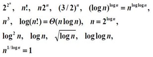


#### 1.1.3. 复杂度分析窍门

1. 若两段算法分别有复杂度`T1(n) = O(f1(n))` 和`T2(n) = O(f2(n))`，则：
```
T1(n) + T2(n) = max(O(f1(n)), O(f2(n)))
T1(n) * T2(n) = O(f1(n) * f2(n))
```
2. 若`T(n)`是关于 n 的 k 阶多项式，那么`T(n) = θ(n^k)`
3. 一个`for`循环的时间复杂度等于循环次数乘以循环体代码的复杂度
4. `if-else`结构的复杂度取决于`if`的条件判断复杂度和两个分支部分的复杂度，总体复杂度**取三者中最大**。


#### 1.1.4. 渐进时间复杂度

渐进时间复杂度是指**`n`趋于无穷时的复杂度**。向有序表中任意一个位置插入元素，插入位置之后的元素依次挪动一个位置，假设元素插入的位置坐标为`k`，则时间复杂度为`O(k)`，渐进时间复杂度为`O(n)`。


### 1.2. 算法设计要求
1. 正确性
2. 可读性
3. 健壮性
4. 效率与低存储量需求


### 1.3. 从哪几个方面进行算法分析
1. 时间复杂度
2. 空间复杂度
3. 稳定性


### 1.4. 本质
1. 算法的本质是寻找规律并实现。
2. 如何找出规律？发现输入和输出的关系，寻找突破点


### 1.5. 数据结构之逻辑结构与物理(存储)结构

1. 逻辑结构：
逻辑结构分为四种类型：**集合结构，线性结构，树形结构，图形结构**。

1.1 集合结构。数据元素同属一个集合，单个数据元素之间**没有任何关系**。

1.2 线性结构。类似于线性关系，也就是说，线性结构中的数据元素之间是**一对一**的关系。

1.3 树形结构。树形结构中的数据元素之间存在**一对多**的关系。（各元素及元素关系所组成图形类似于树状图）。

1.4 图形结构。数据元素之间是**多对多**的关系。

  

2. 物理结构（存储结构）：
物理结构又叫存储结构，分为四种，顺序存储结构、链式存储结构、索引结构、散列结构。

2.1 顺序存储结构。一段连续的内存空间。

- 优点：随机访问
- 缺点：插入删除效率低，大小固定

2.2 链式存储结构。不连续的内存空间。

- 优点：大小动态扩展，插入删除效率高
- 缺点：不能随机访问。

2.3 索引存储结构。为了方便查找，整体无序，但索引块之间有序，需要额外空间，存储索引表。

- 优点：对顺序查找的一种改进，查找效率高
- 缺点：需额外空间存储索引

2.4 散列存储结构。选取某个函数，数据元素根据散列函数计算存储位置可能存在多个数据元素存储在同一位置，引起地址冲突

- 优点：查找基于数据本身即可找到，查找效率高，存取效率高。
- 缺点：存取随机，不便于顺序查找。


### 1.6. 链表与数组
链表类比：寻宝游戏，朋友们散坐在电影院


- 链表：读取O(n)、插入O(1)、删除O(1)
- 数组：读取O(1)、插入O(n)、删除O(n)

对比：
1. 链表擅长**插入和删除**
2. 数组擅长随机访问（数组擅长读取）。

解释：

- 数组查询元素：知道第一个按顺序遍历就行

- 数组增加元素：如果需要给index为10的位置添加，则从index为11的位置开始右移

- 数组删除元素：如果需要删除index为10的位置，则从index为11的位置开始左移

  
链表：
- 链表查找：当同时读取所有元素时，链表的效率很高，读第一个，读第二个，以此类推。

- 但当你需要跳跃，链表的效率就很低了，每次都必须从第一个开始查找

- 链表增加元素：只需要修改它前面的那个元素指向的地址就可以了

- 链表删除元素：只需要将前一个元素指向的地址更改即可


### 1.7. 线性表的存储结构

可分为顺序存储结构和链式存储结构。

1. 顺序存储定义：把逻辑上相邻的数据元素存储在物理上相邻的存储单元中的存储结构。 
2. 链式存储结构: 其结点在存储器中的位置是随意的，即逻辑上相邻的数据元素在物理上不一定相邻。通过指针来实现

区别：
1. 顺序存储时，逻辑上相邻的数据元素，其物理存放地址也相邻。顺序存储的优点是存储密度大，存储空间利用率高；缺点是插入或删除元素时不方便。 
2. 链式存储时，相邻数据元素可随意存放，但所占存储空间分两部分，一部分存放结点值，另一部分存放表示**结点间关系的指针**。链式存储的优点是插入或删除元素时很方便，使用灵活。缺点是**存储密度小，存储空间利用率低**。


### 1.8. 树的分类
斜二叉树、完全二叉树、满二叉树

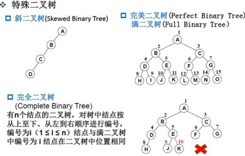


### 1.9. 二叉搜索树
二叉搜索树是一种节点值之间具有一定数量级次序的二叉树，对于树中每个节点：
1. 若其左子树存在，则其左子树中每个节点的值都不大于该节点值；
2. 若其右子树存在，则其右子树中每个节点的值都不小于该节点值。


特点
1. 二分搜索树不一定是完全二叉树
2. 二分搜索树的最大元素节点，一定没有右儿子，不一定是叶子节点。
3. 二分搜索树的最小值，是从根节点一直找左孩子，直到再没有左孩子，就是最小值。其最大值，就是从根节点一直找右孩子，直到再没有右孩子，就是最大值。
4. 若二分搜索树是完全二叉树，则其最小值一定是叶节点，最大值却不一定是叶节点。


#### 1.9.1. 二分搜索树删除元素过程
1. 删除最小值时，如果它有右孩子，就把它的右孩子代替它的位置。
2. 删除最大值时，如果它有左孩子，就把它的左孩子代替它的位置。
3. 如果它左右孩子都有，就找到删除节点的后继节点，即它的右子树上的最小值，代替它。（`harborddeletion`）


如果插入的时候是有序的，那就像快排一样，退化，成了链表。
一个解决方法是提前打乱，但是元素是动态加入的，不能事先知道全部的数组。
另一个解决方法是平衡二叉树。


### 1.10. 平衡二叉树定义(`AVL`)：
它或者是一颗空树，或者具有以下性质的二叉排序树：
它的左子树和右子树的深度之差（**平衡因子**）的绝对值不超过1，且它的左子树和右子树都是一颗平衡二叉树。


一棵AVL树有如下必要条件：
1. 它必须是二叉查找树。
2. 每个节点的左子树和右子树的高度差至多为1。


### 1.11. Trie
Trie 是一种字典，查找效率比二分搜索树的`logN`还快，因为它只与被查找元素出现的个数有关。比如单词，一个个串起来。

`Trie`，又称前缀树或**字典树**，是一种有序树，用于保存关联数组，其中的键通常是字符串。

特点：

1. 与二叉查找树不同，键不是直接保存在节点中，而是由节点在树中的位置决定。
2. 一个节点的所有子孙都有相同的前缀，也就是这个节点对应的字符串，而根节点对应空字符串。
3. 一般情况下，不是所有的节点都有对应的值，只有叶子节点和部分内部节点所对应的键才有相关的值。

应用：
1. `Trie` 的典型应用是用于**统计、排序和保存大量的字符串**（但不仅限于字符串），所以经常被搜索引擎系统用于文本词频统计。
2. 它的优点是：**利用字符串的公共前缀来减少查询时间**，最大限度地减少无谓的字符串比较，查询效率比哈希树高。

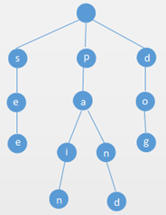

### 1.12. 前序、中序、后序遍历的特性

前序遍历：
1. 访问根节点
2. 前序遍历左子树
3. 前序遍历右子树

中序遍历：
1. 中序遍历左子树
2. 访问根节点
3. 中序遍历右子树

后序遍历：
1. 后序遍历左子树
2. 后序遍历右子树
3. 访问根节点


### 1.13. 已知前序、中序遍历，求后序遍历
例：
```
前序遍历: GDAFEMHZ
中序遍历: ADEFGHMZ
```

画树求法：
1. 第一步，根据前序遍历的特点，我们知道根结点为`G`。

2. 第二步，观察中序遍历`ADEFGHMZ`。其中`root`节点`G`左侧的`ADEF`必然是`root`的左子树，`G`右侧的`HMZ`必然是`root`的右子树。

3. 第三步，观察左子树`ADEF`，左子树的中的根节点必然是大树的`root`的`leftchild`。在前序遍历中，大树的`root`的`leftchild`位于`root`之后，所以左子树的根节点为`D`。

4. 第四步，同样的道理，`root`的右子树节点HMZ中的根节点也可以通过前序遍历求得。在前序遍历中，一定是先把`root`和`root`的所有左子树节点遍历完之后才会遍历右子树，并且遍历的左子树的第一个节点就是左子树的根节点。同理，遍历的右子树的第一个节点就是右子树的根节点。

5. 第五步，观察发现，上面的过程是递归的。先找到当前树的根节点，然后划分为左子树，右子树，然后进入左子树重复上面的过程，然后进入右子树重复上面的过程。最后就可以还原一棵树了。该步递归的过程可以简洁表达如下：
```
1. 确定根,确定左子树，确定右子树。
2. 在左子树中递归。
3. 在右子树中递归。
4. 打印当前根。
```
那么，我们可以画出这个二叉树的形状：


那么，根据后序的遍历规则，我们可以知道，后序遍历顺序为：`AEFDHZMG`

### 1.14. 已知中序和后序遍历，求前序遍历
依然是上面的题，这次我们只给出中序和后序遍历：
```
中序遍历: ADEFGHMZ
后序遍历: AEFDHZMG
```
画树求法：
1. 第一步，根据后序遍历的特点，我们知道后序遍历最后一个结点即为根结点，即根结点为`G`。
2. 第二步，观察中序遍历`ADEFGHMZ`。其中`root`节点`G`左侧的`ADEF`必然是`root`的左子树，`G`右侧的`HMZ`必然是`root`的右子树。
3. 第三步，观察左子树`ADEF`，后序遍历中，左子树`AEFD`的最后一个为左子树的`root`，也就是`D`为左子树的中的根节点。由中序遍历得，`A`为`D`的左子树，`EF`为`D`的右子树。观察后序遍历，`EF`中最后的一个`F`为其`root`。可以知道，`E`为`F`的左子树。
4. 第四步，同样的道理，`root`的右子树节点`HMZ`中的根节点也可以通过后序遍历求得。在后序遍历中，`HZM`最后一个`M`一定是右子树的根节点。
5. 第五步，观察发现，上面的过程是递归的。先找到当前树的根节点，然后划分为左子树，右子树，然后进入左子树重复上面的过程，然后进入右子树重复上面的过程。最后就可以还原一棵树了。

该步递归的过程可以简洁表达如下：
```
1. 确定根,确定左子树，确定右子树。
2. 在左子树中递归。
3. 在右子树中递归。
4. 打印当前根。
```
这样，我们就可以画出二叉树的形状，如上图所示，这里就不再赘述。
那么，前序遍历: `GDAFEMHZ`

### 1.15. 如果一个二叉树，其中序遍历结果与前序遍历结果一样，那么
所有的结点都没有左儿子。


### 1.16. 什么是后继节点和前驱节点
1. 后继节点：一个节点在**中序**遍历中的下一个节点
2. 前驱节点：一个节点在中序遍历中的上一个节点


### 1.17. 二叉树的重要性质
1. n个节点的二叉树一共有`((2n)!)/(n!*(n+1)!)`种
2. 一个二叉树第`i`层的最大节点数为`2^(i-1)`个
3. 二叉树节点计算公式`N=n0+n1+n2`，度为`0`的叶子节点比度为`2`的节点数多一个，即`N=1*n1+2*n2+1`
4. 对任何一棵二叉树T，如果其终端节点数为`n0`，度为`2`的节点数为`n2`，则`n0=n2＋1`
5. 高度为`K`的二叉树中，最多有`2^k-1`个结点。
6. 具有`n`个节点的完全二叉树的深度为`[log2n]+1`，向下取整
7. 如果有一颗有`n`个节点的完全二叉树的节点按层次序编号，对任一层的节点`i`
(1) 如果`i=1`，则节点是二叉树的根，无双亲，如果`i>1`，则其双亲节点为`[i/2]`，向下取整
(2) 如果`2i>n`那么节点i没有左孩子，否则其左孩子为`2i`
(3) 如果`2i+1>n`那么节点没有右孩子，否则右孩子为`2i+1`

8. 设一棵完全二叉树共有699个节点，则在该二叉树中的叶节点数是什么？
```
n=n0 + n1 + n2
n0=n2 + 1
n=699，奇数，说明 n1 为 0；
n=n0 + n0 - 1
n0 = 350，所以叶节点数为350
```

### 1.18. 图论
并查集可以解决是否连接，图论才可以解决路径问题

#### 1.18.1. 分类
- 有向图（微博的关注）、无向图（qq好友）；
  - 无向图是一种特殊的有向图
- 无权图（人与人是否认识）、有权图（交通运输图）

无向图（`undirected graph`）没有箭头，直接相连的节点互为邻居。例如，下面两个图是等价的。


### 1.19. 广度优先搜索
- 如果你在你的整个人际关系网中搜索芒果销售商，就意味着你将沿每条边前行（记住，边是从一个人到另一个人的箭头或连接），因此运行时间至少为`O(边数)`。
- 你还使用了一个队列，其中包含要检查的每个人。将一个人添加到队列需要的时间是固定的，即为`O(1)`，因此对每个人都这样做需要的总时间为`O(人数)`。
- 所以，广度优先搜索的运行时间为`O(人数+边数)`，这通常写作`O(V+E)`，其中`V`为顶点（`vertice`）数，`E`为边数。


### 1.20. 图的连通性，连通分量
- 一张图中可能并非所有节点都互相连接，其中每一部分就是一个连通分量。
- 就像上等社会、中产阶段、底层社会


### 1.21. 连通图
- 如果图中任意两点都是连通的，那么图被称作连通图。
- 如果此图是有向图，则称为**强连通图**（注意：需要双向都有路径）


### 1.22. 生成树
对连通图进行遍历，过程中所经过的边和顶点的组合可看做是一棵普通树，通常称为生成树。

连通图中，由于任意两顶点之间可能含有多条通路，遍历连通图的方式有多种，往往一张连通图可能有多种不同的生成树与之对应。

连通图中的生成树必须满足以下2个条件：
1. 包含连通图中所有的顶点；
2. 任意两顶点之间有且仅有一条通路；

#### 1.22.1. 生成森林
多个连通分量对应的多棵生成树就构成了整个非连通图的生成森林


### 1.23. 邻接点
假若顶点`v`和顶点`w`之间存在一条边，则称顶点`v`和`w`互为邻接点。


### 1.24. 简单图
没有自环边（指向自己）或者平行边（A到B有多个边）


### 1.25. 图的表示方法
有邻接矩阵和邻接表：
- 邻接表是表示相连的两个顶点，适合表示稀疏图
- 邻接矩阵适合表示稠密图

### 1.26. 完全图（典型的稠密图）
图的每个点都和其他所有点都相连，如相似电影推荐

### 1.27. 邻接表
邻接表的缺点是增加边的时候，在判断原来是否已经存在这条边的时候，需要遍历数组，也就是`O(n)`，而邻接矩阵只需要返回`g[v][w]`，它是`O(1)`的。

邻接表的性质，存在多少个结点，就有多少个头结点的数组，每个头结点的数组都指向该结点在图中直接相连的结点。
邻接表的形式：
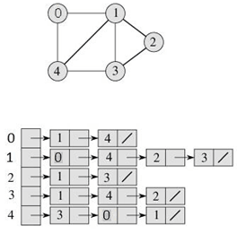


### 1.28. 邻接矩阵
邻接矩阵存储结构就每个顶点用一个一维数组存储边的信息，这样所有点合起来就是用矩阵表示图中各顶点之间的邻接关系。所谓矩阵其实就是二维数组。

对于有 n个顶点的图 `G=(V,E)` 来说，我们可以用一个 `n×n` 的矩阵 A来表示 G 中各顶点的相邻关系，如果 `vi`和 `vj​` 之间存在边（或弧），则 `A[i][j]=1`，否则 `A[i][j]=0`。下图为有向图 G 对应的邻接矩阵：

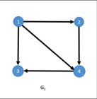


遍历邻边-图算法中最常见的操作
- 邻接矩阵`O(n)`
- 邻接表不需要遍历`O(E)`

图的深度优先遍历-复杂度
- 稀疏图（邻接表）：`O(V+E)`（`E`比`V`大，所以也是`O(E)`）
- 稠密图（邻接矩阵）：`O(V^2)`


### 1.29. 最小生成树`Minimum Span Tree`
1. 找`V-1`条边，连接`V`和顶点，使总权值最小
2. 用途比如电缆布线、网络连接、电路设计
3. 针对带权无向图
4. 针对连通图

Prim算法：将顶点归并，与边数无关，适于稠密网

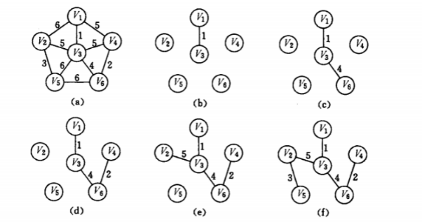


Kruskal算法：将边合并，适合稀疏网


- Prim 当前正在考虑的所有的横切边中最短的那个
- Kruskal 每次取所有边中的最短边，但是不能构成环

时间复杂度
- LazyPrim：`O(ElogE)`不把已经遍历过的边拿出去
- Prim：`O(ElogV)`
- Kruska：`O(ElogE)`


### 1.30. 切分定理Cut Property
1. 把图中的结点分为两部分，成为一个切分（`Cut`）。
2. 如果一个边的两个端点，属于切分（`Cut`）不同的两边，这个边称为横切边（`CrossingEdge`）。
3. 切分定理：给定任意切分，横切边中权值最小的边必然属于最小生成树。

绿色的边是横切边：

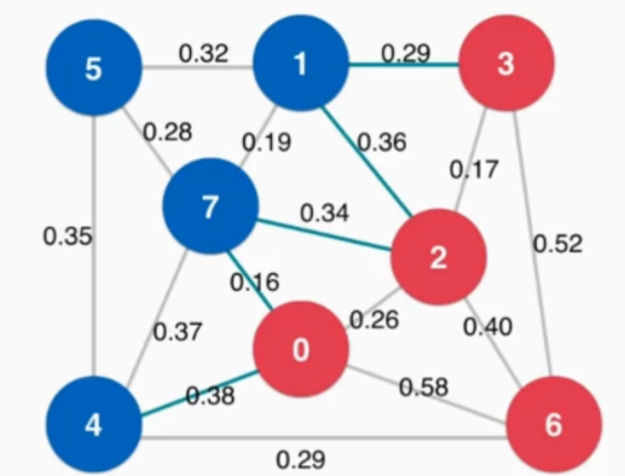


### 1.31. 最短路径问题
图的广度优先遍历，就是找到了最短路径树，也是单源最短路径（同一个起始点）


### 1.32. 狄克斯特拉算法
找出加权图中前往X的最短路径
- 前提：图中不能有负权边
- 只适用于有向无环图（`directed acyclic graph`，DAG）
- 在无向图中，**每条边都可以看作一个环**。
- 复杂度`O(ElogV)`

松弛操作：通过一个新点，看看经过它到达所有点的最短路径

不能有负权边，举例：从 0 到 2 再到 1 再到 2，比 0 直接到 2 等短。
- 有负权环的话，就不存在最短路径了，因为可以一直转下去，直到负无穷。


狄克斯特拉算法包含4个步骤：
1. 找出**最便宜的节点**，即可在最短时间内前往的节点。
2. 对于**该节点的邻居，检查是否有前往它们的更短路径**，如果有，就更新其开销。
3. 重复这个过程，直到对图中的每个节点都这样做。
4. 计算最终路径。

`dijkstra`算法中`dist`应该如何初始化？
正无穷（不能为负无穷或-1，因为`dijkstra`算法不能用于负权边）

- 要计算非加权图中的最短路径，可使用广度优先搜索。
- 要计算加权图中的最短路径，可使用狄克斯特拉算法。


### 1.33. `Bellman-Ford`算法
- 前提：图中不能有负权环
- `Bellman-Ford`可以判断图中是否有负权环
- 复杂度`O(EV)`

如果一个图中没有负权环，从一点到另外一点的最短路径，最多经过所有的`V`个顶点，有`V-1`条边，否则，存在顶点经过了两次，即存在负权环。

过程：
1. 对一个点的一次松弛操作，就是找到经过这个点的另外一条路径，多一条边，权值更小。
2. 如果一个图中没有负权环，从一点到另外一点的最短路径，最多经过所有的V个顶点，有V-1条边
3. 对所有的点进行V-1次松弛操作，理论上就找到了从源点到其他所有点的最短路径。
4. 如果还可以继续松弛，说明原图中有负权环。

有负权边的一般是有向的，否则从`A`到`B`再从`B`到`A`就形成负权环了

单源最短路径算法对比：
| 算法| 有无环|有无向|时间复杂度|
| ---| ---|---|---|
|  dijkstra| 无负权环 |有向无向图均可 | O(ElogV)|
| Bellman-Ford|无负权环|有向图|O(VE)|
|拓扑排序|有向无环图，DAG|有向图|O(V + E)|


`Floyed`算法
1. 处理无负权环的图
2. 时间复杂度：`O(V^3)`


### 1.34. 拓扑排序
在一个有向图中，对所有的节点进行排序，要求没有一个节点指向它前面的节点。

1. 先统计所有节点的入度，对于入度为0的节点就可以分离出来，然后把这个节点指向的节点的入度减一。
2. 一直做改操作，直到所有的节点都被分离出来。
3. 如果最后不存在入度为0的节点，那就说明有环，不存在拓扑排序，也就是很多题目的无解的情况。

下面是算法的演示过程：


注意：
1. 拓扑排序就是为了判断有向图是不是有环的。
2. 有向无环图（DAG）才有拓扑排序，非DAG图没有拓扑排序一说。


拓扑排序（`Topological Sorting`）是一个有向无环图（DAG, `Directed Acyclic Graph`）的所有顶点的线性序列。且该序列必须满足下面两个条件：
1. 每个顶点出现且只出现一次。
2. 若存在一条从顶点 A 到顶点 B 的路径，那么在序列中顶点 A 出现在顶点 B 的前面（没有一个节点指向它前面的节点）。


#### 1.34.1. 判断是否有环方法：
1. 拓扑排序
2. 深度优先遍历
3. 广度优先遍历

### 1.35. 树和图的关系
树是一种特殊的图，其中没有往后指的边。

### 1.36. 堆
堆分为两种：最大堆和最小堆，两者的差别在于节点的排序方式。
1. 在最大堆中，父节点的值比每一个子节点的值都要大。
2. 在最小堆中，父节点的值比每一个子节点的值都要小。

这就是所谓的“堆属性”，并且这个属性对堆中的每一个节点都成立。

### 1.37. 堆和搜索二叉树的区别
- 堆必须是完全二叉树
- 堆中任一结点的值是其子树所有结点的最大值或最小值（最大堆、最小堆）
- 搜索二叉树：每棵子树头结点比左子树上所有节点大，比右子树上所有节点小


### 1.38. 散列表（`hashtable`）

散列函数很重要。前面的散列函数将所有的键都映射到一个位置，而最理想的情况是，散列函数将键均匀地映射到散列表的不同位置。
如果散列表存储的链表很长，散列表的速度将急剧下降。然而，如果使用的散列函数很好，这些链表就不会很长！

散列表的性能：
1. 平均情况：查找`O(1)`、插入`O(1)`、删除`O(1)`
2. 最差情况：查找`O(n)`、插入`O(n)`、删除`O(n)`

`O(1)`被称为常量时间。它并不意味着马上，而是说不管散列表多大，所需的时间都相同。

- 链表：查找O(n)、插入O(1)、删除O(1)
- 数组：查找O(1)、插入O(n)、删除O(n)
- 散列表（最差情况）：查找O(n)、插入O(n)、删除O(n)
- 散列表（平均情况）：查找O(1)、插入O(1)、删除O(1)


在平均情况下，散列表的查找（获取给定索引处的值）速度与数组一样快，而插入和删除速度与链表一样快，因此它兼具两者的优点！
但在最糟情况下，散列表的各种操作的速度都很慢。
因此，在使用散列表时，避开最糟情况至关重要。


为此，需要避免冲突。而要避免冲突，需要有：
1. 较低的填装因子；
2. 良好的散列函数。

散列表的装填因子 = 散列表的元素数 / 位置总数


一旦填装因子开始增大，你就需要在散列表中添加位置，这被称为调整长度（`resizing`）。

填装因子越低，发生冲突的可能性越小，散列表的性能越高。一个不错的经验规则是：一旦填装因子大于`0.7`，就调整散列表的长度。


## 2. 排序
### 2.1. 工程上的排序
1. 工程上的排序是综合排序
2. 数组较小时，插入排序
3. 数组较大时，快速排序或者其他`O(N*logN)`的排序

### 2.2. 经典排序的空间复杂度
1. `O(1)`：插入排序、选择排序、冒泡排序、堆排序、希尔排序
2. `O(logN)~O(n)`：快速排序
3. `O(N)`：归并排序
4. `O(M)`：计数排序、基数排序

堆排序如果用递归的方式时间复杂度是`O(log(N)`，因为用到了函数栈。

数组分布区间范围小的话，计数排序比较有优势，比如身高。

基本有序的情况下：快排最慢，堆排最快。

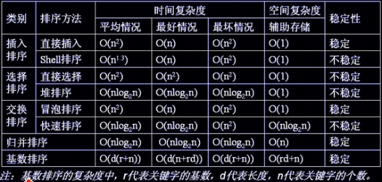

### 2.3. 不稳定排序
不稳定排序有选择排序、快排、堆排、希尔
1. 选择排序举例：`2221`=>第一次选择最小值`1`的时候会和第一个2交换
2. 堆排序举例：`555`=>建立大根堆后，堆顶元素会换到最后位置上去，第一个`5`就会跑到最后去
3. 快排举例：`43335`=>如果随机选中中间的`3`作为基准的话，左右两边的`3`要么都被分到右边，要么都被分到左边
4. 希尔排序举例：`5115`=>步长为`2`的时候，第一个`5`和第二个`1`交换，改变了两个`1`的相对位置

### 2.4. 排序初始状态
以下四种排序方法的算法复杂度与数组的初始状态无关：
一堆（堆排序）乌龟（归并排序）选（选择排序）基（基数排序）友

1. 算法复杂度与初始状态无关的有：选择排序、堆排序、归并排序、基数排序。
2. 元素总比较次数与初始状态无关的有：选择排序、基数排序。
3. 元素总移动次数与初始状态无关的有：归并排序、基数排序。


### 2.5. 从1000个数字中找出最大的10个字？
这个有多种方法
1. 堆排序算法。选前10个数调整成最小堆，从第11个数开始逐一与堆顶比较，较小则直接抛弃，较大则替换堆顶，然后调整维持10个元素的最小堆。
2. 快速排序。将输入元素进行一趟快速排序划分为较小的A集合，pivot，和较大的B集合，若B集合元素个数加一个 pivot 超过所需个数，则将B集合作为输入重复进行，否则在A集合找剩余所需元素，直到刚好找到所需个数结束。
3. 分治算法。将1000个元素分100组，分别找到最大元素，在100个最大元素这找较大的10个，选出这10个元素在原来100组中所代表的10组，其余组舍去。然后在这100个元素中找最大的10个


### 2.6. 数据表A中每个元素距其最终位置不远，为节省时间排序，应采用什么方法排序？
插入不是堆排

- “每个元素距其最终位置不远”，可以理解成序列相对有序
- 那么原题就转换成在序列相对有序的情况下，哪种排序算法的时间复杂度更小?
- 直接插入排序是数据越有序越快，最快时间复杂度可达到O(n).
- 选择排序无论何时都是O（n^2）
- 快速排序越有序越慢，它要从后到前遍历找比基准小的，时间复杂度达到O(n^2)

### 2.7. 查找

1. 折半查找最坏的情况下查找`log(n)+1`次
2. 二叉查找树最坏的情况是查找`n`次。


### 2.8. 有序数组合并的最小比较次数
有两个从小到大排好序的数组，长度分别为`N`和`M`，将这两个数组合并成一个有序数组的最小比较次数是？
1. 当数组为`1,2,3,4,5`和`6,7,8,9,10,11`这种时，比较次数最少，为`min(5,6)=5`；
2. 当数组为`1,3,5,7,9,11`和`2,4,6,8,10`这种的数组时，比较次数最多，为`M+N-1`

### 2.9. 二分查找、顺序查找、分块查找对比
1. 分块查找的数据组织形式为，块间有序，块内可以无序（有序也可以），并且在索引表中用索引项来快速查找
2. 三种静态查找算法：顺序、二分/折半、索引/分块查找
3. 无论使用什么确定块，速度一定是二分>分块>顺序
   


### 2.11. 几种常见的数据结构的操作性能对比

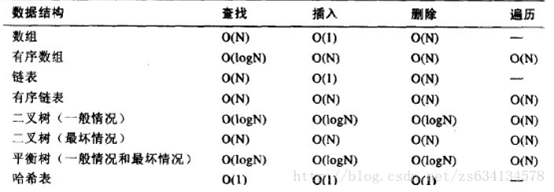

由上图可见：
1. 平衡二叉树的查找，插入和删除性能都是`O(logN)`，其中查找和删除性能较好；
2. 哈希表的查找、插入和删除性能都是`O(1)`，都是最好的。


### 2.12. BloomFilter
用途：判断一个元素是否在一个集合中、检查一个英语单词是否正确拼写；

原理：
1. 位数组与`Hash`函数的联合使用。是一个包含 m 位的位数组，每位初始化为 0，有 k 个不同的 hash 函数，可将集合元素映射到位数组的某一位。
2. 插入元素需根据 k 个 hash 函数得到 k 个位，置为1。
3. 查询时判断这 k 个位（有0则该元素肯定不在集合中，都为1则该元素有可能在集合中）

特点：
1. 优点：有良好的空间效率和时间效率，插入、查询O(n)，安全性高（不保存元素本身）
2. 缺点：正确率低，有可能不在集合中的元素在位数组查询的位得到都为1。


### 2.13. 水库算法
1. 我们有 n 个数据，要选取 m 个数据。前 m 个数据直接选择；
2. 然后从 m+1 个数据开始决定该数据是否留下也就是从第 m+1 个数据开始以`m/m+1`的概率决定是否留下。
3. 留下是根据先前已经留下的m个数据随机选取一个做交换。


### 2.14. Set和Map的时间复杂度
Set和Map，对于不同的实现，有不同的时间复杂度

||普通数组实现|顺序数组实现|二分搜索树（平衡）|哈希表|
|---|:-:|:-:|:-:|:-:|
|插入|O(1)|O(n)|O(log(n))|O(1)|
|查找|O(n)|O(logn)|O(log(n))|O(1)|
|删除|O(n)|O(n)|O(log(n))|O(1)|


C++的set和map底层都是用平衡二叉树实现的，`unordered_map`和`unordered_set`的底层实现为哈希表。

哈希表的一个缺点是，失去了数据的顺序性

##### 2.14.0.1. 什么是数据的顺序性？
1. 数据集中的最大值和最小值
2. 某个元素的前驱和后继
3. 某个元素的 `floor` 和 `cell`
4. 某个元素的排位 `rank`
5. 选择某个排位的元素 `select`


### 2.15. N皇后问题
对角线1：相加为常数，其和为i+j
对角线2：相减为常数

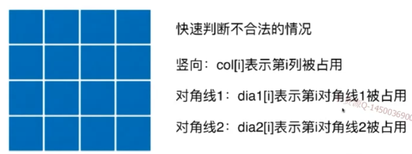

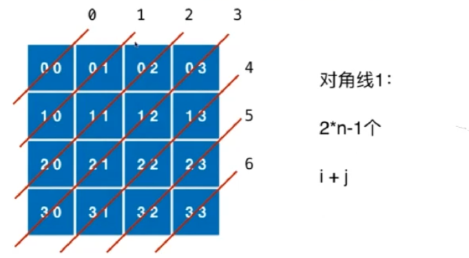

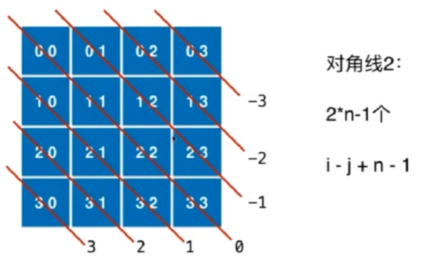
解法：
回溯函数 backtrack(row = 0).

- 从第一个 row = 0 开始.
- 循环列并且试图在每个 column 中放置皇后.
  - 如果方格 (row, column) 不在攻击范围内

    - 在 (row, column) 方格上放置皇后。
    - 排除对应行，列和两个对角线的位置。
    - If 所有的行被考虑过，row == N
      - 意味着我们找到了一个解
    - Else
      - 继续考虑接下来的皇后放置 backtrack(row + 1).
    - 回溯：将在 (row, column) 方格的皇后移除.


```js
function solution(n) {
  let cols = []
  for (let i = 0; i < n ;i ++) {
    cols.push(0)
  }
  let dia1 = []
  let dia2 = []

  for (let i = 0; i < 2 * n - 1; i++) {
    dia1.push(0)
    dia2.push(0)
  }
  queens = new Set()
  let res = []
  backtrack()

  function couldPlace(row, col) {
    return !(cols[col] + dia1[row - col] + dia2[row + col])
  }
  function placeQueen(row, col) {
    queens.add(`${row}-${col}`)
    cols[col] = 1
    dia1[row - col] = 1
    dia2[row + col] = 1
  }

  function removeQueen(row, col) {
    queens.delete(`${row}-${col}`)
    cols[col] = 0
    dia1[row - col] = 0
    dia2[row + col] = 0
  }

  function addSolution() {
    let solution = []
    let _list = Array.from(queens).map(item => {
      return item.split('-')
    })
    _list.sort((a, b) => {
      return a[0] - b[0]
    })
    for (let item of _list) {
      let temp = []
      for (let i = 0; i < n; i ++) {
        temp.push('.')
      }
      temp[+item[1]] = 'Q'
      solution.push(temp.join(''))
    }
    res.push(solution)
  }

  function backtrack(row = 0) {
    for (let col = 0; col < n; col++) {
      if (couldPlace(row, col)) {
        placeQueen(row, col)
        if (row + 1 === n) {
          addSolution()
        } else {
          backtrack(row + 1)
        }
        removeQueen(row, col)
      }
    }
  }

  return res
}

const res = solution(4)
console.log(res)
```
复杂度分析

1. 时间复杂度：`O(N!)`. 放置第 1 个皇后有 `N` 种可能的方法，放置两个皇后的方法不超过 `N (N - 2)` ，放置 3 个皇后的方法不超过 `N(N - 2)(N - 4)` ，以此类推。总体上，时间复杂度为 `O(N!)` .
2. 空间复杂度：`O(N)` . 需要保存对角线和行的信息。

参考资料：[N皇后, LeetCode](https://leetcode-cn.com/problems/n-queens/solution/nhuang-hou-by-leetcode/)


### 2.16. 动态规划和记忆化搜索
斐波那契数列原始解法：直接`return fib(n-1) + fib(n-2)`，问题是存在大量重复计算，所以有如下的优化方法。
记忆化搜索-自顶向下的解决问题：
```js
let memo = []
function fib(n) {
    if (n == 0) return 0
    if (n == 1) return 1
    if (!memo[n]) {
        memo[n] = fib(n-1) + fib(n-2)
    }
    return memo[n]
}
```
动态规划-自底向上的解决问题：
```js
let memo = []
function fib(n) {
    memo[0] = 0
    memo[1] = 1
    for (let i = 2; i < n + 1; i ++) {
        memo.push(memo[i-1] + memo[i-2])
    }
    return memo[n]
}
```
```
                                记忆化搜索
                            自顶向下的解决问题
                           /
                重叠子问题 
递归问题  --->   最优子结构
                           \
                                动态规划
                             自底向上的解决问题
```

### 2.17. 哈夫曼树
1. 从根节点到每个叶子节点的长度为`Ik`，每个叶节点带有权值`Wk`，则每个叶节点的带权路径长度（WPL）之和为`Wk*Ik`的累加和。
2. 给定N个权值作为N个叶子结点，构造一棵二叉树，若该树的带权路径长度（WPL）达到最小，称这样的二叉树为最优二叉树，也称为哈夫曼树(`Huffman Tree`)。权值较大的结点离根较近。
3. **出现机率高的字母使用较短的编码**，反之出现机率低的则使用较长的编码，这便使编码之后的字符串的平均长度、期望值降低。


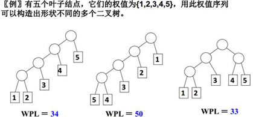

#### 2.17.1. 哈夫曼树的构造
每次把权值最小的两棵树合并

例1：
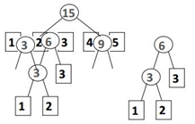

例2：
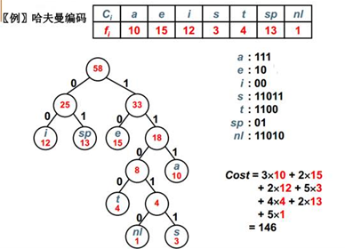

#### 2.17.2. 哈夫曼树的特点
1. 没有度为1的结点
2. n 个叶子节点的哈夫曼树共有 `2*n-1` 个节点
3. 哈夫曼树的任意非叶节点的左右子树交换后仍是哈夫曼树
4. 对同一组权值，可能存在不同构的两棵哈夫曼树


