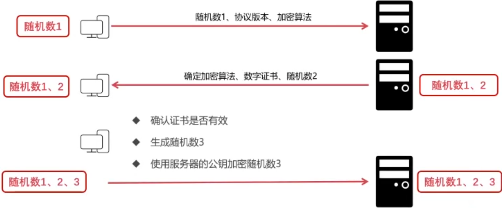

- [1. HTTPS](#1-https)
  - [1.1. 数字证书](#11-数字证书)
    - [1.1.1. 数字证书包含内容（重点是**对象公开秘钥**）：](#111-数字证书包含内容重点是对象公开秘钥)
  - [1.2. SSL](#12-ssl)
  - [1.3. HTTPS 数据通信过程](#13-https-数据通信过程)
  - [1.4. SSL安全参数握手过程](#14-ssl安全参数握手过程)

## 1. HTTPS

### 1.1. 数字证书
数字证书是可信任组织颁发给特定对象的认证（类似身份证）
- 可信任组织是客户端和服务端都信任的
- 特定对象可以是人、服务器、组织

#### 1.1.1. 数字证书包含内容（重点是**对象公开秘钥**）：
- 证书格式、版本号
- 证书序列号
- 签名算法
- 有效期
- 对象名称
- 对象公开密钥

### 1.2. SSL
SSL安全套接层（Secure Socket Layer），介于应用层和传输层之间
- 保证数据安全和数据完整
- 对传输数据进行加密后传输

### 1.3. HTTPS 数据通信过程
先进行443端口的TCP连接，再进行SSL安全参数握手，然后是客户端和服务端数据传输

### 1.4. SSL安全参数握手过程
1. 客户端发送随机数1、协议版本、加密算法给服务端
2. 服务端返回确认加密算法、数字证书、随机数2（协商加密算法）
3. 客户端确定证书是否有效，生成随机数3，使用服务器的公钥加密随机数3，并发给服务端
4. 双方分别使用随机数1、2、3和相同的加密算法 生成对称秘钥，并使用这个对称秘钥通信

总结：
- 综合使用对称加密、非对称加密
- 双方分别生成秘钥，没有经过传输
