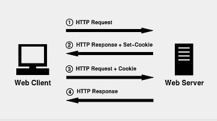

## `cookie` 和 `session`
本来`session`是一个**抽象概念**，开发者为了实现中断和继续等操作，将`user agent`和`server`之间一对一的交互，抽象为“会话”，进而衍生出“会话状态”，也就是`session`的概念。
 而`cookie`是一个**实际存在**的东西，http 协议中定义在 `header` 中的字段。可以认为是 `session`的一种后端无状态实现。
而我们今天常说的 “session”，是为了绕开 cookie 的各种限制，通常**借助 cookie 本身**和**后端存储**实现的，一种更高级的会话状态实现。
所以 cookie 和 session，你可以认为是同一层次的概念，也可以认为是不同层次的概念。具体到实现，session 因为 `session id` 的存在，通常要借助 cookie 实现，但这并非必要，只能说是通用性较好的一种实现方案。


### cookie 
服务器通过设置`set-cookie`这个响应头，将 cookie 信息返回给浏览器，浏览器将响应头中的 cookie 信息保存在本地，当下次向服务器发送 HTTP 请求时，浏览器会自动将保存的这些 cookie 信息添加到请求头中。
`set-cookie`格式如下，
```
set-cookie: value[; expires=date][; domain=domain][; path=path][; secure]
```
通过 cookie，服务器就会识别出浏览器，从而保证返回的数据是这个用户的。
重点：

- 通过`set-cookie`设置
- 下次请求会自动带上
- 键值对，可设置多个




##### `cookie`属性
- max-age
  - 过期时间有多长
  - 默认在浏览器关闭时失效
- expires
  - 到哪个时间点过期
- secure
  - 表示这个 cookie 只会在 https 的时候才会发送
- HttpOnly
  - 设置后无法通过在 js 中使用 document.cookie 访问
  - 保障安全，防止攻击者盗用用户 cookie
- domain
  - 表示该 cookie 对于哪个域是有效的。


### session

- 存放在服务器的一种用来存放用户数据的类似 HashTable 的结构
- 浏览器第一次发送请求时，服务器自动生成了 HashTable 和 SessionID 来唯一标识这个 hash 表，并将 sessionID 存放在 cookie 中通过响应发送到浏览器。浏览器第二次发送请求会将前一次服务器响应中的 sessionID 随着 cookie 发送到服务器上，服务器从请求中提取 sessionID，并和保存的所有 sessionID 进行对比，找到这个用户对应的 hash 表。
  - 一般这个值是有时间限制的，超时后销毁，默认 30min
- 当用户在应用程序的 web 页面间挑转时，存储在 session 对象中的变量不会丢失而是在整个用户会话中一直存在下去。
- session 依赖于 cookie，因为 sessionID 是存放在 cookie 中的。
  - 如果浏览器禁用了 cookie ，同时 session 也会失效（但是可以通过其它方式实现，比如在 `url` 中传递 `sessionID`）


##### sesssion 与 cookie 的区别

- cookie 存在客户端，session 存在于服务端。
- cookie 在客户端中存放，容易伪造，不如 session 安全
- session 会消耗大量服务器资源，cookie 在每次 HTTP 请求中都会带上，影响网络性能


### `session`和`token`

1. `session`是**有状态**的，一般存于服务器内存或硬盘中，当服务器采用**分布式或集群**时，`session`就会面对**负载均衡**问题。
2. `token`是**无状态**的，`token`字符串里就**保存了所有的用户信息**。


##### `token`过程

- 客户端登陆传递信息给服务端，服务端收到后把用户信息加密（`token`）传给客户端，客户端将`token`存放于`localStroage`等容器中。
- 客户端每次访问都传递token，服务端解密`token`，就知道这个用户是谁了。
- 通过cpu加解密，服务端就不需要存储`session`占用存储空间，就很好的解决负载均衡多服务器的问题了。
- 这个方法叫做`JWT(Json Web Token)`


##### `session`和`token`的区别

1. session存储于服务器，可以理解为一个状态列表，拥有一个唯一识别符号sessionId，通常存放于cookie中。服务器收到cookie后解析出sessionId，再去session列表中查找，才能找到相应session。依赖cookie。
2. cookie类似一个令牌，装有sessionId，存储在客户端，浏览器通常会自动添加。
3. token也类似一个令牌，无状态，用户信息都被加密到token中，服务器收到token后解密就可知道是哪个用户。需要开发者手动添加。
4. jwt只是一个**跨域认证**的方案


##### `token`可以抵抗CSRF，`cookie+session`不行

- 在post请求的瞬间，`cookie`会**被浏览器自动添加到请求头**中。
- 但`token`不同，`token`是开发者为了防范csrf而特别设计的令牌，**浏览器不会自动添加到`headers`里**，**攻击者也无法访问用户的`token`**，所以提交的表单无法通过服务器过滤，也就无法形成攻击。


参考资料：[cookie 和 session](https://github.com/huyaocode/webKnowledge/blob/master/%E7%BD%91%E7%BB%9C/cookie%E5%92%8Csession.md)


