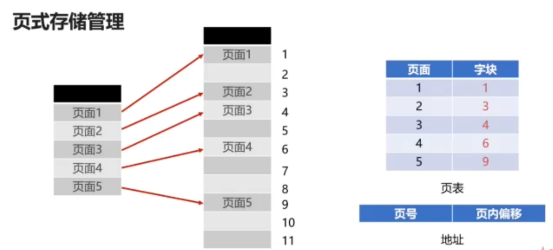
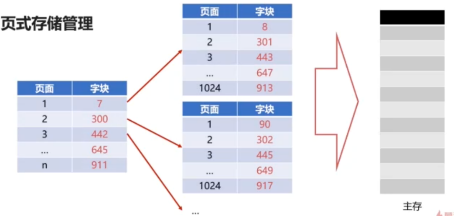
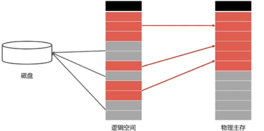

- [6. 作业管理之死锁](#6-作业管理之死锁)
  - [6.1. 死锁的产生](#61-死锁的产生)
  - [6.2. 死锁的四个必要条件](#62-死锁的四个必要条件)
  - [6.3. 预防死锁的方法](#63-预防死锁的方法)
  - [6.4. 银行家算法](#64-银行家算法)
- [7. 存储管理之内存分配与回收](#7-存储管理之内存分配与回收)
  - [7.1. 内存分配过程](#71-内存分配过程)
  - [7.2. 动态分区分配数据结构](#72-动态分区分配数据结构)
  - [7.3. 动态分区分配算法](#73-动态分区分配算法)
  - [7.4. 内存回收的过程](#74-内存回收的过程)
- [8. 存储管理之段页式存储管理](#8-存储管理之段页式存储管理)
  - [8.1. 字块和页面](#81-字块和页面)
  - [8.2. 页式存储管理](#82-页式存储管理)
    - [什么是分页机制？](#什么是分页机制)
  - [8.3. 段式存储管理](#83-段式存储管理)
    - [什么是分段机制？](#什么是分段机制)
  - [8.4. 段页式存储管理](#84-段页式存储管理)
    - [什么是内存抖动（颠簸）？](#什么是内存抖动颠簸)
- [9. 存储管理之虚拟内存](#9-存储管理之虚拟内存)
  - [9.1. 程序的局部性原理](#91-程序的局部性原理)
  - [9.2. 虚拟内存的置换算法](#92-虚拟内存的置换算法)
- [10. Linux的存储管理](#10-linux的存储管理)
  - [10.1. 伙伴系统](#101-伙伴系统)
  - [10.2. Linux交换空间](#102-linux交换空间)

## 1. 计算机操作系统  <!-- omit in toc -->

### 6. 作业管理之死锁

什么是死锁？
死锁：互相等待，一直阻塞下去（如五哲学家进餐模型）

#### 6.1. 死锁的产生

- 竞争资源（本质：共享资源数量不足）
- 进程调度顺序不当

#### 6.2. 死锁的四个必要条件

1. 互斥条件（进程对资源的使用是排他性的使用，资源只能由一个进程使用，其他进程只能等待）
2. 请求保持条件（进程至少保持一个资源，又提出新的资源请求；新资源被占用，请求被阻塞；被阻塞的进程不释放自己保持的资源）
3. 不可剥夺条件（进程获得的资源在未完成使用前不能被剥夺，获得的资源只能由进程自身释放）
4. 环路等待条件（发生死锁时，必然存在进程-资源环形链）

#### 6.3. 预防死锁的方法

- 系统规定进程运行之前，一次性申请所有需要的资源（消除请求保持条件），进程在运行期间不会提出资源请求
- 当一个进程请求新的资源得不到满足时，必须释放占有的资源（消除不可剥夺条件）
- 可用资源线性排序，申请必须按照需要递增申请，不再形成环路（摒弃环路等待条件）

#### 6.4. 银行家算法

背景：

- 客户申请的贷款有限，每次申请需声明最大资金量
- 银行家在满足贷款时，都应该给用户贷款
- 客户在使用完贷款后，能够及时归还贷款

需要是三个表：已分配资源表、所需资源表、可分配资源表

过程：
所需资源表减去已分配资源表，可以得到还需分配资源表，与可分配资源表比较，看能满足哪个进程，就把资源分配给它，然后等它运行完，归还后运行其他进程

### 7. 存储管理之内存分配与回收

#### 7.1. 内存分配过程
1. 单一连续分配：只能在单用户、单进程的操作系统中使用，主存分为系统区和用户区
2. 固定分区分配：内存空间分为若干固定大小的区域，每个分区只提供给一个程序使用，互不干扰（多道程序中存储管理的最简单方式）
3. 动态分区分配（最常用）

#### 7.2. 动态分区分配数据结构
1. 动态分区空闲表数据结构
2. 动态分区空闲链数据结构（节点合并，节点需要记录可存储的容量）

#### 7.3. 动态分区分配算法
1. 首次适应算法（FF算法）（从开始顺序查找适合内存区，若没有合适的空闲区，则该次分配失败，一般是链表结构，每次从头部开始，使得头部地址空间不断被划分，循环适应算法，从上一次结束的位置开始）
2. 最佳适应算法（BF算法）（按照容量大小排序，找到最佳合适空闲区）
3. 快速使用算法（QF算法）（有多个空闲区链表，每个链表存储一种容量的空闲区）

#### 7.4. 内存回收的过程
四种情况：

- 第一种，回收区在空闲区后面：
  - 不需要新建空闲链表节点
  - 只需要把空闲区1的容量增大到回收区即可

- 第二种，回收区在空闲区前面：
  - 将回收区与空闲区合并
  - 新的空闲区使用回收区的地址

- 第三种，回收区在两个空闲区中间：
  - 将空闲区1、空闲区2和回收区合并
  - 新的空闲区使用空闲区1地址

- 第四种，单一的回收区：
  - 为回收区创建新的空闲节点
  - 插入到相应的空闲区链表中去

### 8. 存储管理之段页式存储管理

段页式是进程角度，上面是物理内存角度
#### 8.1. 字块和页面
1. 字块是相对物理设备的定义
2. 页面是相对逻辑空间的定义

#### 8.2. 页式存储管理
1. 将进程逻辑空间 等分成若干大小的页面
2. 相应的把物理内存空间分成与页面大小相同的物理块
3. 以页面为单位把进程空间装进物理内存中分散的物理块

注意：
1. 页面大小应该适中，过大难以分配，过小内存碎片过多
2. 页面大小通常是`512B~8kB`

##### 什么是分页机制？
- 操作系统为了**高效管理内存，减少碎片**
- **逻辑地址和物理地址分离**的内存分配管理方案
- 程序的逻辑地址划分为固定大小的页(`Page`)
- 物理地址划分为同样大小的帧(`Frame`) （不一定连续）
- 通过页表对应逻辑地址和物理地址

页表记录进程逻辑空间与物理空间的映射，**页面号和字块号**的映射关系。地址中页号相当于字号、页内偏移相当于字块内偏移

多级页表，减少页表占用的空间，按需取页表，加载到内存中：

问题：有一段连续的逻辑分布在多个页面中，将大大降低执行效率

#### 8.3. 段式存储管理
1. 将进程逻辑空间划分为若干段（非等分）
2. 段的长度由连续逻辑的长度决定
3. 主函数MAIN、子程序段X、子函数Y等

##### 什么是分段机制？
- 分段是为了满足代码的一些逻辑需求
- 数据共享，数据保护，动态链接等(比如编写一个忘记递归出口的函数导致栈溢出)
- 通过段表实现逻辑地址和物理地址的映射关系
- 每个段内部是连续内存分配，段和段之间是离散分配的

段表：
段号、基址（起始地址）、段长

段式存储和页式存储的对比：
1. 段式存储和页式存储都离散地管理了进程的逻辑空间
2. **页是物理单位**，**段是逻辑单位**
3. **分页是为了合理利用空间**，**分段是满足用户要求**
4. **页的大小固定**，**段长度可以动态变化**
5. 页表信息是一维的，段表信息是二维的

#### 8.4. 段页式存储管理
1. 分页可以提高内存利用率（虽然存在内存碎片），分段可以更好的满足用户需求
2. 先将逻辑空间按段式管理分成若干段
3. 再将段内空间按页式管理分成若干页

段页地址
段号、段内页号、页内地址

示例：

##### 什么是内存抖动（颠簸）？
本质是**频繁的页调度行为**
- 频繁的页调度，进程不断产出缺页中断。交换内存到硬盘时，需要一种策略，比如当前不用的话把它交换进去，策略有`LRU`、`LFU`、`先进先出`，策略使用不当时，更换一个页，进入到一个硬盘里，后面又需要它，又把它交换回来（用户电脑性能急剧下降）
- 置换一个页，又不断再次需要这个页
- 运行程序太多；页面替换策略不好。终止进程或者增加物理内存

### 9. 存储管理之虚拟内存

一个游戏十几G，而物理内存只有4G，怎么运行起来？

产生原因：
1. 有些进程实际需要的内存很大，超过物理内存的容量
2. 多道程序设计，使得每个进程可用物理内存更加稀缺

原理：
把程序使用内存划分，将部分暂时不用的内存放置在辅存

什么是虚拟内存？
把一部分**暂时不用的内存信息放到硬盘上**

- 局部性原理（包括空间和时间），程序运行时只有部分必要的信息装入内存
  - 时间局部性：一块内存被访问时，很有可能在不远的将来还会被访问
  - 空间局部性：一块内存被访问时，那么它周围的内存也很有可能被访问
- 内存中暂时不需要的内容放到硬盘上，需要的时候再把它交换回来
- 系统似乎提供了比实际内存大得多的容量，称之为虚拟内存

#### 9.1. 程序的局部性原理
指CUP访问存储器时，无论是存取指令还是存取数据，所访问的存储单元都趋于聚集在一个较小的连续区域中。

1. 程序运行时，无需全部装入内存，装载部分即可
2. 如果访问页不在内存，则发出缺页中断，发起页面置换
3. 从用户角度看，程序拥有很大的空间，即是虚拟内存
4. 虚拟内存实际是对物理内存的补充，速度接近于内存，成本接近于辅存

#### 9.2. 虚拟内存的置换算法
1. 先进先出算法(FIFO)
2. 最不经常使用算法(LFU)
3. 最近最少使用算法(LRU)

### 10. Linux的存储管理

Buddy内存管理算法
1. 解决内存外碎片问题
2. 经典的内存管理算法
3. 算法基于计算机处理二进制的优势具有极高的效率
4. 将内存外碎片问题转移到内存内碎片问题

页内碎片：
已经被分配出去（能明确指出属于哪个进程）的内存空间大于请求所需的内存空间，不能被利用的内存空间
页外碎片：
还没有被分配出去（不属于任何进程），但由于太小无法分配给申请内存空间的新进程的内存空闲块。

页外碎片相当于太挫找不到对象，页内碎片相当于太优秀而对象太垃圾

原则
- 向上取整为2的幂大小
  - 70k => 128k
  - 129k => 256k
  - 666k => 1024k

#### 10.1. 伙伴系统
- 一片连续内存的伙伴是相邻的另一片大小一样的连续内存
- 创建一系列空闲块链表，每一种都是2的幂
- 以100k为例，看有没有128k、256k、512k、1M有没有空闲空间，直到找到1M才有，然后从1M拆下512k，再拆下256k，再拆下128k，分配完毕。
- 回收的时候，以后一点点拼回1M

#### 10.2. Linux交换空间
1. 交换空间(Swap)是磁盘的一个分区
2. Linux物理内存满时，会把一些内存交换至Swap空间
3. Swap空间是初始化系统时配置的

Swap空间与虚拟内存对比：
1. 都存在于磁盘，都与主存发生置换
2. Swap空间是操作系统概念，虚拟内存是进程概念
3. Swap空间解决系统物理内存不足的问题，虚拟内存解决进程物理内存不足的问题

