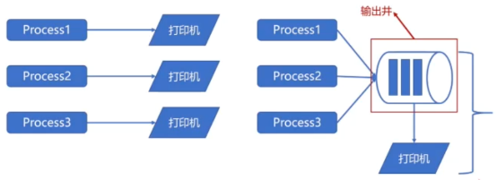

## 设备管理

广义的IO设备
- 对CPU而言，凡是对CPU进行数据输入的都是输入设备
- 对CPU而言，凡是CPU进行数据输出的都是输出设备

按**使用特性**分类：
- [ ] 存储设备（U盘、内存、磁盘）
- [ ] 交互IO设备（键盘、鼠标、显示器）

按**信息交换的单位**分类
- [ ] **块设备**（以块为单位，如磁盘、SD卡）
- [ ] **字符设备**（打印机、Shell终端）
- [ ] Linux中`c`(`char`)：字符设备文件，`b`(`block`)：块设备文件

按设备的共享属性分类：
- [ ] 独占
- [ ] 共享
- [ ] 虚拟设备

按传输速率分类：
- [ ] 低速
- [ ] 中速
- [ ] 高速设备

IO设备的缓冲区
- [ ] 原因：**CPU与IO设备的速率不匹配**
- [ ] 减少CPU处理IO请求的频率
- [ ] 提高CPU与IO设备之间的并行性

专用缓存区：

注意：
- [ ] 专用缓存区只适用于特定的IO进程
- [ ] 当这样的IO进程比较多时，对内存的消耗也很大
- [ ] 操作系统划出**可供多个进程使用的公共缓存区**，称为**缓冲池**

缓冲池：

`SPOOLing`技术（虚拟设备技术，还是为了解决CPU与IO设备的速率不匹配）
- [ ] 关于**慢速字符设备**如何与**计算机主机交换信息**的一种技术
- [ ] 利用高速共享设备将低速的独享设备模拟为高速的共享设备
- [ ] 逻辑上，系统为每一个用户都分配了一台独立的高速独享设备

 
`SPOOLing`技术把同步调用低速设备改为异步调用

三个进程同时想用打印机，这时开辟磁盘空间，将三个进程的输入写入磁盘，再打印，打印机并不属于任何进程，也就是进程并不直接使用打印机，而是把输出写入磁盘，然后`SPOOLing`技术将这些文件送到打印机里面

- [ ] 在输入、输出之间增加了**排队转储环节**（输入井、输出井）
- [ ] `SPOOLing`负责输入（出）井与低速设备之间的调度
- [ ] 逻辑上，进程直接与高速设备交互（不是与物理设备交互），减少了进程的等待时间

相当于房产中介
