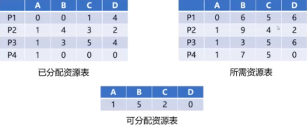

- [1. 作业管理之进程调度](#1-作业管理之进程调度)
  - [1.1. 进程调度](#11-进程调度)
  - [1.2. 三个机制](#12-三个机制)
  - [1.3. 分类](#13-分类)
  - [1.4. 非抢占式的调度](#14-非抢占式的调度)
  - [1.5. 抢占式的调度](#15-抢占式的调度)
  - [1.6. 进程调度算法](#16-进程调度算法)
- [2. 作业管理之死锁](#2-作业管理之死锁)
  - [2.1. 死锁的产生](#21-死锁的产生)
  - [2.2. 死锁的四个必要条件](#22-死锁的四个必要条件)
  - [2.3. 预防死锁的方法](#23-预防死锁的方法)
  - [2.4. 银行家算法](#24-银行家算法)

## 作业管理 <!-- omit in toc -->
### 1. 作业管理之进程调度

#### 1.1. 进程调度

- 计算机通过决策决定哪个就绪进程可以获得CPU使用权
- 前提是多道程序设计
- 保存 旧进程的运行信息，清除旧进程（收拾包袱）
- 选择新进程，准备运行环境并分配CPU（新进驻）

#### 1.2. 三个机制

- 就绪队列的排队机制
- 选择运行进程的委派机制（选择就绪进程，分配CPU给它）
- 新老进程的上下文切换机制（保存当前进程的上下文信息，装入被委派执行进程的运行上下文）

#### 1.3. 分类

1. 非抢占式的调度
2. 抢占式调度

#### 1.4. 非抢占式的调度

- 处理器一旦分配给某个进程，就让该进程一直使用下去
- 调度程序不以任何原因抢占正在使用的处理器
- 直到进程完成工作或者因为IO阻塞才会让出处理器

#### 1.5. 抢占式的调度

- 允许调度程序以一定的策略暂停当前运行的进程
- 保存旧进程的上下文信息，分配处理器给新进程

对比：
||抢占式调度|非抢占式调度|
|---|---|---|
|系统开销|频繁切换，开销大|切换次数少，开销小|
|公平性|相对公平|不公平|
|应用|通用系统|专用系统|

#### 1.6. 进程调度算法

1. 先来先服务调度算法
2. 短进程优先调度算法（不利于长作业进程的执行）
3. 高优先权优先调度算法（前台进程 优先级高于后台进程）
4. 时间片轮转调度算法（最公平）

只有最后一个是抢占式的调度

### 2. 作业管理之死锁

什么是死锁？
- **互相等待，一直阻塞下去**（如五哲学家进餐模型）

#### 2.1. 死锁的产生

- 竞争资源（本质：共享资源数量不足）
- 进程调度顺序不当

#### 2.2. 死锁的四个必要条件

1. 互斥条件（进程对资源的使用是**排他性的使用**，资源只能由一个进程使用，其他进程只能等待）
   2. 请求保持条件（进程**至少保持一个资源，又提出新的资源请求**；新资源被占用，请求被阻塞；被阻塞的进程不释放自己保持的资源）
3. 不可剥夺条件（进程获得的资源在**未完成使用前不能被剥夺**，获得的资源只能由进程自身释放）
4. 环路等待条件（发生死锁时，必然存在**进程-资源环形链**）

#### 2.3. 预防死锁的方法

- 系统规定进程运行之前，**一次性申请所有需要的资源**（消除请求保持条件），进程在运行期间不会提出资源请求
- 当一个进程**请求新的资源得不到满足时，必须释放占有的资源**（消除不可剥夺条件）
- **可用资源线性排序**，申请必须按照需要递增申请，不再形成环路（摒弃环路等待条件）

#### 2.4. 银行家算法

背景：

- 客户申请的贷款有限，每次申请需声明最大资金量
- 银行家在满足贷款时，都应该给用户贷款
- 客户在使用完贷款后，能够及时归还贷款

需要是三个表：
1. 已分配资源表
2. 所需资源表
3. 可分配资源表

过程：
- 所需资源表减去已分配资源表，可以得到还需分配资源表，与可分配资源表比较，看能满足哪个进程，就把资源分配给它，然后等它运行完，归还后运行其他进程

