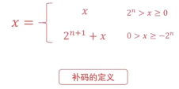
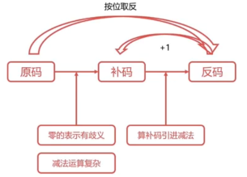

## 计算机组成原理

### 计算机发展的四个阶段
1. 电子管计算机（1946年`ENIAC`埃尼阿克）
2. 晶体管
3. 集成电路
4. 超大规模集成电路计算机

未来？生物计算机？量子计算机？

微型计算机的发展历史，由单核CPU发展到多核CPU

计算机分类：
- 超级计算机(`TFlop/s`)
- 大型计算机(去IOE)
- 迷你计算机（普通服务器、云服务）
- 工作站
- 微型计算机（个人计算机）

`TFlop/s`=每秒一万亿次浮点计算

去IOE行动（阿里提出，高维护费用）：
 - `IBM Oracle EMC`，把大型机替换为普通服务器

### 冯诺依曼体系
- 将**程序指令和数据**一起存储的计算机设计概念结构
- 存储程序指令，设计通用电路
- 必须有存储器、控制器、运算器、输入设备、输出设备
- 现代计算机都是冯诺依曼机
- CPU=运算器+控制器

冯诺依曼瓶颈：
- CPU和存储器分开，CPU和存储器速率之间的问题无法调和，CPU处理速度快，经常空转等待数据传输

现代计算机结构：
- 在冯诺依曼体系结构基础上修改，解决CPU与存储设备之间的性能差异问题
- CPU=`运算器+控制器+存储器`（内存和CPU的寄存器）
- 可以理解为`以存储器为核心`

### 程序翻译与程序解析

1. 程序翻译：`L1`编译成`L0`（编译器）
2. 程序解析：`L1`经`L0`变为`L0`（解释器）

- 计算机执行的指令都是`L0`
- 翻译过程中生成新的`L0`程序，解释过程中不生成新的`L0`程序(输入输出)
- 解释过程由`L0`编写的解释器去解释`L1`程序

举例：
1. 程序翻译：`c/c++`  `Object-C`  `Golang`
2. 程序解释：`Python` `Php` `JS`

翻译+解释：`Java`、`C#`
`Java`程序编译成`JVM`字节码，再解释成机器码

### 计算机的计算单位
容量单位：
- 物理层面，高低电平记录信息，理论上只认识0/1两种状态（bit）
- 8比特 = 1字节
- Byte KB MB GB TB PB EB

硬盘商一般用10进位标记容量，所以买的硬盘小于标注的大小

速度单位，网络速度：

为什么电信拉的100M光纤，测试峰值速度只有12M每秒？
- 网络常用单位为Mbps
- `1M/s = 1Mbps = 1Mbit/s = (100/8)MB/s = 12.5MB/s`

CPU速度：
- CPU的速度一般体现为CPU的时钟频率，单位一般是Hz，主流CPU的时钟频率都在`2GHz`以上，（高低电平变换频率在每秒20亿次以上）

Hz就是秒分之一，每秒钟周期性变动重复次数的计量
- 能听见蜜蜂翅膀振动而不能听见蝴蝶翅膀振动声音，只因为蜜蜂振动频率高（`400Hz`）与蝴蝶振动频率（`15Hz`）

### 原码、补码、反码
原码表示法：
- 使用0表示正数，1表示负数
- 规定符号位位于数值第一位
- 人类最容易理解

问题：
- 0有两种表示方法：00、10
- 原码运算复杂，操作数符号不同时，需要判断操作数绝对值大小，使用绝对值大的数减去绝对值小的数，对于符号值，以绝对值大的为准

补码：
目的：
- 正数代替负数表示
- 加法代替减法，从而消除减法（但没有解决）

反码：

规律：

- 正数的原码、补码、反码一样
- 负数的反码等于原码 除符号位外按位取反
- 负数的补码等于反码+1

小数的补码计算和整数的补码计算相同
