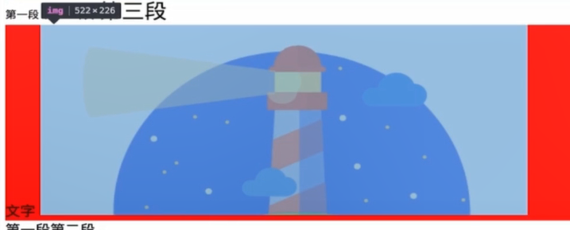

- [1. `link`标签和`@import`标签的区别](#1-link标签和import标签的区别)
- [2. 径向渐变](#2-径向渐变)
- [3. 线性渐变](#3-线性渐变)
- [4. CSS `attr()` 函数](#4-css-attr-函数)
- [5. text-shadow和box-shadow对比](#5-text-shadow和box-shadow对比)
- [6. 关于`vw`、`vh`、`vmin`、`vmax`](#6-关于vwvhvminvmax)
  - [6.1. vw、vh、vmin、vmax 的含义](#61-vwvhvminvmax-的含义)
  - [6.2. vw、vh 与 % 百分比的区别](#62-vwvh-与--百分比的区别)
  - [6.3. vmin、vmax 用处](#63-vminvmax-用处)
- [8. CSS Modules](#8-css-modules)
- [10. 如何去掉 antd 的 Input 组件获取焦点时的蓝色边框](#10-如何去掉-antd-的-input-组件获取焦点时的蓝色边框)
- [11. 关于`Normalize.css`](#11-关于normalizecss)
- [12. Chrome中文字体下限`12px`](#12-chrome中文字体下限12px)
- [13. `em`与`rem`的重要区别](#13-em与rem的重要区别)
- [14. `word-wrap/word-break/white-space`区别](#14-word-wrapword-breakwhite-space区别)
- [15. filter属性](#15-filter属性)
- [16. 画一条0.5px的线](#16-画一条05px的线)
- [17. 移动端 1px 像素问题及解决办法](#17-移动端-1px-像素问题及解决办法)
- [18. 什么是 FOUC？如何避免](#18-什么是-fouc如何避免)
- [19. inline-block 的间隙](#19-inline-block-的间隙)
- [20. 你对 line-height 是如何理解的？](#20-你对-line-height-是如何理解的)
- [21. line-height 三种赋值方式有何区别？（带单位、纯数字、百分比）](#21-line-height-三种赋值方式有何区别带单位纯数字百分比)
- [22. 图片下面有一个缝隙是因为什么](#22-图片下面有一个缝隙是因为什么)
- [23. target、currentTarget的区别？](#23-targetcurrenttarget的区别)
- [24. `-webkit-overflow-scrolling: touch`](#24--webkit-overflow-scrolling-touch)
- [25. `object.getBoundingClientRect()`](#25-objectgetboundingclientrect)
- [26. `documentElement` 和 `body` 的异同点](#26-documentelement-和-body-的异同点)
  - [26.1. scrollTop](#261-scrolltop)
- [27. 图标ICON的解决方案](#27-图标icon的解决方案)
- [28. `display:none => display: block`过程中其他动画不生效](#28-displaynone--display-block过程中其他动画不生效)


### 1. `link`标签和`@import`标签的区别

1. `link`属于`html`标签，而`@import`是`css`提供的
2. 页面被加载时，`link`会**同时被加载**，而`@import`引用的css会等到**页面加载结束后**加载。
3. link是html标签，因此没有**兼容性**，而`@import`只有`IE5`以上才能识别。
4. 当用`JS`控制`dom`去**改变样式**的时候，只能使用`link`标签，由于 `DOM` 方法是**基于文档**的，无法使用`@import`的方式插入样式。

注意：
- CSS 的`link`标签是同时加载的 
- `script`标签才会加载完一个再加载另一个（默认，加上`defer/async`就不同了）


### 2. 渐变
#### 2.1. 径向渐变

- `radial-gradient`的**渐变轴**是**圆心到顶点的一条线**，设置渐变色都是在渐变轴上设置的。
- 线性渐变的渐变轴比较简单，就是**那条线**。


#### 2.2. 线性渐变

`background-image: linear-gradient(direction, color-stop1, color-stop2, ...);`
比如：
```
linear-gradient(12deg, red, yellow); 
linear-gradient(to bottom right, red , yellow);
linear-gradient(red 0%, orange 25%, yellow 50%, green 75%, blue 100%)
```
如果两个或多个颜色终止在同一位置，则在该位置声明的第一个颜色和最后一个颜色之间的过渡将是一条生硬线。

`to top`, `to bottom`, `to left` 和 `to right`这些值会被转换成角度`0度`、`180度`、`270度`和`90度`。其余值会被转换为一个**以向顶部中央方向为起点顺时针旋转**的角度。


### 3. CSS `attr()` 函数
`attr()` 函数返回**选择元素的属性值**，如`attr(data-name)`, `attr(href)`

 

### 4. `text-shadow`和`box-shadow`对比
`text-shadow`和`box-shadow`都有`blur`属性（模糊距离），**`box-shadow`还有`spread`（阴影的大小）**。

- `h-shadow`：必需的。水平阴影的位置。允许负值
- `v-shadow`：必需的。垂直阴影的位置。允许负值


比如，`text-shadow: 1px 1px 1px #333`，指的是，水平阴影位置，垂直阴影位置，模糊距离，阴影的颜色


### 5. 关于`vw`、`vh`、`vmin`、`vmax`

####  5.1. vw、vh、vmin、vmax 的含义
- vw：视窗宽度的百分比（1vw 代表视窗的宽度为 1%）
- vh：视窗高度的百分比
- vmin：当前 vw 和 vh 中较小的一个值
- vmax：当前 vw 和 vh 中较大的一个值


####  5.2. vw、vh 与 % 百分比的区别

- % 是相**对于父元素**的大小设定的比率，vw、vh 是**视窗大小**决定的。
- vw、vh 优势在于能够**直接获取高度**，而用 % 在没有设置 body 高度的情况下，是无法正确获得可视区域的高度的，所以这是挺不错的优势。


#### 5.3. vmin、vmax 用处

做**移动页面开发**时，如果使用 vw、wh 设置**字体大小**（比如 5vw），在**竖屏**和**横屏**状态下显示的字体大小是不一样的。
由于 vmin 和 vmax 是当前较小的 vw 和 vh 和当前较大的 vw 和 vh。这里就可以用到 vmin 和 vmax。使得文字大小在横竖屏下保持一致。


### 6. CSS Modules

CSS的规则都是全局的，任何一个组件的样式规则，都对整个页面有效。产生局部作用域的唯一方法，就是使用一个独一无二的class的名字，不会与其他选择器重名。但是当我们与其他人共同开发的时候，无法保证一定与其他人不同，这时候就要用到 CSS Modules了。

将样式文件`App.css`输入到`style`对象，然后引用`style.title`代表一个class。构建工具会将类名`style.title`编译成一个**哈希字符串**。`App.css`也会同时被编译。

我们使用的`antd`组件的样式大部分都是全局样式，使用局部方式声明class经过编译后，无法与组件的默认样式class匹配，样式自然就无法进行覆盖，要覆盖默认样式就需要使用全局样式。使用`global`声明的class，都不会被编译成**哈希字符串**也就能够进行覆盖了。


注意:
css module在react使用的时候，如果类不存在或者写的位置或方法不对，是挂载不上去的。


### 7. 关于`Normalize.css`

`Normalize.css`是一种`CSS reset`的替代方案。它在默认的HTML元素样式上提供了跨浏览器的高度一致性。相比于传统的`CSS reset`，`Normalize.css`是一种现代的、为HTML5准备的优质替代方案。


### 8. Chrome中文字体下限`12px`


### 9. `em`与`rem`的重要区别

`rem`是CSS3新增的一个相对单位（`root em`，根`em`），相对于根元素(即`html`元素)`font-size`计算值的倍数

`em`是相对于父元素的`font-size`，继承的特点，浏览器有默认(`16px`)

区别：它们计算的规则一个是依赖父元素，另一个是依赖根元素计算。


### 10. `word-wrap/word-break/white-space`区别

- `white-space`，**控制空白字符的显示**，同时还能控制**是否自动换行**。它有五个值：`normal | nowrap | pre | pre-wrap | pre-line`
- `word-break`，**控制单词如何被拆分换行**。它有三个值：`normal | break-all | keep-all`
- `word-wrap`（overflow-wrap）**控制长度超过一行的单词是否被拆分换行**，是`word-break`的补充，它有两个值：`normal | break-word`

 


### 12. 什么是 FOUC？如何避免

Flash Of Unstyled Content：用户定义样式表加载之前浏览器使用默认样式显示文档，用户样式加载渲染之后再从新显示文档，造成页面闪烁。

**解决方法**：把样式表放到文档的`head`


### 13. inline-block 的间隙

**两个并列的 `inline-block` 中间会有一条裂缝，这个的原因是两个标签之间有空格，浏览器把这些空格当成文字中空格**，所以这两个块中间多少有间隙。

解决办法：

1. 删除两个标签间的空格，但是这样 `html` 排版不好
2. **容器元素 `font-size: 0` 然后再在里面再重新设置字体大小**

### 14. 你对 line-height 是如何理解的？

- `line-height` 指一行字的高度，包含了字间距，实际上是**下一行基线到上一行基线距离**
- 如果一个标签没有定义 `height` 属性，那么其最终表现的高度是由 `line-height` 决定的
- **一个容器没有设置高度，那么撑开容器高度的是 `line-height` 而不是容器内的文字内容**
- 把 `line-height` 值设置为 `height` 一样大小的值可以实现单行文字的垂直居中
- `line-height` 和 `height` 都能撑开一个高度，`height` 会触发 `haslayout`（一个低版本 IE 的东西），而 `line-height` 不会

#### 14.1. line-height 三种赋值方式有何区别？（带单位、纯数字、百分比）

- 带单位：`px` 是固定值，而 `em` 会参考父元素 `font-size` 值计算自身的行高
- 纯数字：会把比例传递给后代。例如，父级行高为 `1.5`，子元素字体为 `18px`，则子元素行高为 `1.5 * 18 = 27px`
- 百分比：将计算后的值传递给后代

### 15. 图片下面有一个缝隙是因为什么



因为 `img` 也相当于一个 `inline` 的元素，**`inline` 就要遵守行高的构成，它会按照 `base` 基线对齐**，基线对齐的话那么它就会和底线间有一个缝隙。

如何解决： 因为它会遵守文字对齐方案，那么就把**图片的对齐方式修改为 `vertical-align: bottom`。或者让他`display: block`，**这样图片虽然会换行，但是没有间隙了。

### 16. target、currentTarget的区别？

`currentTarget`当前所绑定事件的元素

`target`当前被点击的元素

### 17. `-webkit-overflow-scrolling: touch`

1. 作用

可控制元素在移动设备有滚动回弹效果，可惯性滚动

2. 适应场景

在`ios`移动端上，设置容器`overflow-y:scroll;`使容器内元素滚动时，滑动会很卡顿，使用`-webkit-overflow-scrolling:touch;`可以解决该问题。 

原理：该属性开启了硬件加速
缺点：耗内存


### 18. `object.getBoundingClientRect()`


1. 返回的结果是包含完整元素的最小矩形，并且拥有`left, top, right, bottom, x, y, width, height`这几个以像素为单位的只读属性用于描述整个边框。
2. **除了`width` 和 `height` 以外的属性是相对于视图窗口的左上角来计算的**。
3. 当计算边界矩形时，会考虑视口区域（或其他可滚动元素）内的滚动操作，也就是说，当滚动位置发生了改变，`top`和`left`属性值就会随之立即发生变化（因此，它们的值是相对于视口的，而不是绝对的）。
4. 如果你需要获得相对于整个网页左上角定位的属性值，那么只要给`top`、`left`属性值加上当前的滚动位置（通过 `window.scrollX` 和 `window.scrollY`），这样就可以获取与当前的滚动位置无关的值。


### 19. 图标ICON的解决方案

1. 上古时期，雪碧图`CSS sprite`
    - 无法缩放，无法用`CSS`控制
2. 近代，`Font Icon`
    - 用字体文件的字符编码代表图标，通过特定的`class`加伪类插入到浏览器中。
4. 现代和未来，`SVG`
    - 完全可控，而`Font Icon`只能控制字符相关的属性
    - `SVG`即取即用，而`Font Icon`要下载全部的字体文件
    - `Font Icon`还有奇怪的`bug`，当文件加载失败时，浏览器可能把`Icon`渲染成各种各样的字符


### 20. `display:none => display: block`过程中其他动画不生效

比如`opacity: 0 => opacity: 1`，即使对透明度设置了动画，一样不起作用，除非去掉`display: none`，但会占据位置，违背了初衷。

解决方法：
`display: none;` => `display: block; opacity: 0;` => `display: block; opacity: 1;`
拆成两步走，第二步可以加动画。


