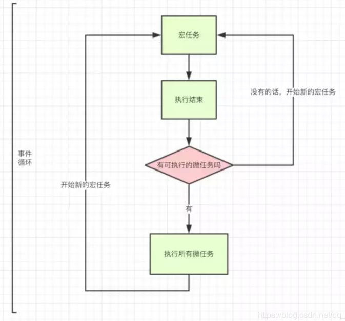

## Event Loop
##### 一、为什么`JavaScript`是单线程？
JavaScript 语言的一大特点就是单线程，也就是说，**同一个时间只能做一件事**。那么，为什么JavaScript 不能有多个线程呢？这样能提高效率啊。

JavaScript的单线程，与它的用途有关。作为浏览器脚本语言，JavaScript的主要用途是与用户互动，以及操作DOM。这决定了它只能是单线程，否则会带来很复杂的同步问题。比如，假定JavaScript同时有两个线程，一个线程在某个DOM节点上添加内容，另一个线程删除了这个节点，这时浏览器应该以哪个线程为准？

所以，为了避免复杂性，从一诞生，JavaScript就是单线程，这已经成了这门语言的核心特征，将来也不会改变。

为了利用多核CPU的计算能力，HTML5提出Web Worker标准，允许JavaScript脚本创建多个线程，但是子线程完全受主线程控制，且不得操作DOM。所以，这个新标准并没有改变JavaScript单线程的本质。

##### 二、任务队列
单线程就意味着，所有任务需要排队，前一个任务结束，才会执行后一个任务。如果前一个任务耗时很长，后一个任务就不得不一直等着。

如果排队是因为计算量大，CPU忙不过来，倒也算了，但是很多时候CPU是闲着的，因为IO设备（输入输出设备）很慢（比如Ajax操作从网络读取数据），不得不等着结果出来，再往下执行。

JavaScript语言的设计者意识到，这时**主线程完全可以不管IO设备，挂起处于等待中的任务，先运行排在后面的任务**。等到IO设备返回了结果，再回过头，把挂起的任务继续执行下去。

于是，所有任务可以分成两种，一种是**同步任务（synchronous）**，另一种是**异步任务（asynchronous）**。同步任务指的是，**在主线程上排队执行**的任务，只有前一个任务执行完毕，才能执行后一个任务；异步任务指的是，**不进入主线程、而进入"任务队列"（task queue）**的任务，只有"任务队列"通知主线程，某个异步任务可以执行了，该任务才会进入主线程执行。

具体来说，异步执行的运行机制如下。（同步执行也是如此，因为它可以被视为没有异步任务的异步执行。）

（1）所有同步任务都在主线程上执行，形成一个**执行栈（execution context stack）**。

（2）主线程之外，还存在一个"任务队列"（task queue）。只要异步任务有了运行结果，就在"任务队列"之中放置一个事件。

（3）一旦"执行栈"中的所有同步任务执行完毕，系统就会读取"任务队列"，看看里面有哪些事件。那些对应的异步任务，于是结束等待状态，进入执行栈，开始执行。

（4）主线程不断重复上面的第三步。


下图就是主线程和任务队列的示意图。


只要主线程空了，就会去读取"任务队列"，这就是JavaScript的运行机制。这个过程会不断重复。


##### 三、事件和回调函数
"任务队列"是一个**事件的队列**（也可以理解成消息的队列），**IO设备完成一项任务，就在"任务队列"中添加一个事件**，表示相关的异步任务可以进入"执行栈"了。主线程读取"任务队列"，就是读取里面有哪些事件。

"任务队列"中的事件，除了IO设备的事件以外，还包括一些**用户产生的事件（比如鼠标点击、页面滚动等等）**。只要指定过回调函数，这些事件发生时就会进入"任务队列"，等待主线程读取。

所谓"回调函数"（callback），就是那些会**被主线程挂起来的代码**。异步任务必须指定回调函数，当主线程开始执行异步任务，就是执行对应的回调函数。

"任务队列"是一个先进先出的数据结构，排在前面的事件，优先被主线程读取。主线程的读取过程基本上是自动的，只要执行栈一清空，"任务队列"上第一位的事件就自动进入主线程。但是，由于存在后文提到的"定时器"功能，主线程首先要检查一下执行时间，某些事件只有到了规定的时间，才能返回主线程。

##### 四、Event Loop
主线程从"任务队列"中读取事件，这个过程是循环不断的，所以整个的这种运行机制又称为Event Loop（事件循环）。


上图中，主线程运行的时候，产生堆（heap）和栈（stack），栈中的代码调用各种外部API，它们在"任务队列"中加入各种事件（click，load，done）。只要栈中的代码执行完毕，主线程就会去读取"任务队列"，依次执行那些事件所对应的回调函数。

执行栈中的代码（同步任务），总是在读取"任务队列"（异步任务）之前执行。请看下面这个例子。

```js
var req = new XMLHttpRequest();
req.open('GET', url);    
req.onload = function (){};    
req.onerror = function (){};    
req.send();
```
上面代码中的req.send方法是Ajax操作向服务器发送数据，它是一个异步任务，意味着只有当前脚本的所有代码执行完，系统才会去读取"任务队列"。所以，它与下面的写法等价。

```js
var req = new XMLHttpRequest();
req.open('GET', url);
req.send();
req.onload = function (){};    
req.onerror = function (){};  
```
也就是说，指定回调函数的部分（onload和onerror），在send()方法的前面或后面无关紧要，因为它们属于执行栈的一部分，系统总是执行完它们，才会去读取"任务队列"。

### 判断打印顺序

```js
setTimeout(function() {
  console.log('定时器')
}, 0)
new Promise((resolve) => {
  console.log('执行for循环')
  resolve()
}).then(() => {
  console.log('then函数')
})
console.log('执行结束')
```
执行结果：
```
执行for循环，执行结束，then函数，定时器
```
运行解释：
1. 这段代码作为宏任务，进入主线程。 
2. 先遇到`setTimeout`，那么将其回调函数注册后分发到宏任务`Event Queue`。
3. 接下来遇到了`Promise`，`new Promise`立即执行，`then`函数分发到微任务`Event Queue`。 
4. 遇到`console.log()`，立即执行。 
5. 好啦，整体代码`script`作为第一个宏任务执行结束，看看有哪些微任务？我们发现了`then`在微任务`Event Queue`里面，执行。 
6. ok，第一轮事件循环结束了，我们开始第二轮循环，当然要从宏任务`Event Queue`开始。我们发现了宏任务`Event Queue`中`setTimeout`对应的回调函数，立即执行。 
7. 结束。

### 判断打印顺序
```js
console.log('1')
setTimeout(() => {
  console.log('2')
  process.nextTick(() => {
    console.log('3')
  })
  
  new Promise((resolve) => {
    console.log('4')
    resolve()
  }).then(() => {
    console.log('5')
  })
})

process.nextTick(() => {
  console.log('6')
})
new Promise((resolve) => {
  console.log('7')
  resolve()
}).then(() => {
  console.log('8')
})

setTimeout(() => {
  console.log('9')
  process.nextTick(() => {
    console.log('10')
  })
  
  new Promise(() => {
    console.log('11')
    resolve()
  }).then(() => {
    console.log('12')
  })
})
```
整段代码，共进行了三次事件循环，完整的输出为：
```
[1，7，6，8]，[2，4，3，5]，[9，11，10，12]
```
### 判断打印顺序
```js
setTimeout(function() {
  console.log(1)
}, 0);

new Promise(function(resolve, reject) {
  console.log(2);
  resolve();
}).then(function() {
  console.log(3)
}).then(function() {
  console.log(4)
});
 
process.nextTick(function(){
  console.log(5)
});
 
console.log(6);
```
输出为：
```
2,6,5,3,4,1
```
注意：
- `process.nextTick`在`Promise.then`之前
- 即使有多个`then`函数，也会在下一个事件循环之前执行。


### 宏任务、微任务
- 宏仁务主要是： `script`（全局任务），`setTimeout` ，`setInterval` ，`setImmediate` ，`I/O` ，`UI rendering`
- 微任务主要是： `process.nextTick`, `Promise.then`, `Object.observer`, `MutationObserver`.



- 宏任务：当前调用栈中执行的代码成为宏任务。（主代码快，定时器等等）。
- 微任务： 当前（此次事件循环中）宏任务执行完，在下一个宏任务开始之前需要执行的任务,可以理解为回调事件。（`promise.then`，`process.nextTick`等等）。
- 宏任务中的事件放在`callback queue`中，由事件触发线程维护；微任务的事件放在微任务队列中，由`js`引擎线程维护。


运行机制：
- 在执行栈中执行一个**宏任务**。
- 执行过程中遇到**微任务**，将微任务添加到**微任务队列**中。
- 当前宏任务执行完毕，**立即执行微任务队列**中的任务。
- 当前微任务队列中的任务执行完毕，检查渲染，**GUI线程**接管渲染。
- 渲染完毕后，**js线程**接管，开启**下一次事件循环**，执行**下一次宏任务**（事件队列中取）


### `async`函数、`setTimeOut`、`Promise`的打印顺序
```js
async function async1() {
    console.log('async1 start')
    await async2()
    console.log('async1 end')
} 

async function async2() {
    console.log('async2')
} 
console.log('script start')
setTimeout(function() {
    console.log('setTimeout')
}, 0)
async1()
new Promise(resolve => {
    console.log('promise1')
    resolve()
}).then(() => {
    console.log('promise2')
})
console.log('script end')
```

打印顺序：

```
script start
async1 start
async2
promise1
script end
async1 end
promise2
setTimeout
```
async 函数返回一个 Promise 对象，当函数执行的时候，一旦遇到 `await` 就会先返回（让出线程），等到触发的异步操作完成，再接着执行函数体内后面的语句。


当调用一个 `async` 函数时，会返回一个 `Promise` 对象。当这个 `async` 函数返回一个值时，`Promise` 的 `resolve` 方法会负责传递这个值；当 `async` 函数抛出异常时，Promise 的 reject 方法也会传递这个异常值。

await
- 后面跟表达式（`express`）：一个 `Promise` 对象或者任何要等待的值。
- 返回值（`return_value`）：返回 `Promise` 对象的处理结果。如果等待的不是 `Promise` 对象，则返回该值本身。

Promise是一个立即执行函数，但是他的成功（或失败：`reject`）的回调函数`resolve`却是一个异步执行的回调。当执行到`resolve()`时，这个任务会被放入到**回调队列**中，等待调用栈有空闲时事件循环再来取走它。

注意：async 函数中 await 语句的下一句是微任务。

## 变式一

在第一个变式中我将 async2 中的函数也变成了 Promise 函数，代码如下：

```js
async function async1() {
  console.log("async1 start");
  await async2();
  console.log("async1 end");
}
async function async2() {
  //async2做出如下更改：
  new Promise(function (resolve) {
    console.log("promise1");
    resolve();
  }).then(function () {
    console.log("promise2");
  });
}
console.log("script start");

setTimeout(function () {
  console.log("setTimeout");
}, 0);
async1();

new Promise(function (resolve) {
  console.log("promise3");
  resolve();
}).then(function () {
  console.log("promise4");
});

console.log("script end");
```
执行结果：
```
script start
async1 start
promise1
promise3
script end
promise2
async1 end
promise4
setTimeout
```

在第一次 macrotask 执行完之后，也就是输出`script end`之后，会去清理所有 microtask。所以会相继输出`promise2`， `async1 end` ，`promise4`。

## 变式二

在第二个变式中，我将 async1 中 await 后面的代码和 async2 的代码都改为异步的，代码如下：

```js
async function async1() {
  console.log("async1 start");
  await async2();
  //更改如下：
  setTimeout(function () {
    console.log("setTimeout1");
  }, 0);
}
async function async2() {
  //更改如下：
  setTimeout(function () {
    console.log("setTimeout2");
  }, 0);
}
console.log("script start");

setTimeout(function () {
  console.log("setTimeout3");
}, 0);
async1();

new Promise(function (resolve) {
  console.log("promise1");
  resolve();
}).then(function () {
  console.log("promise2");
});
console.log("script end");
```

可以先自己看看输出顺序会是什么，下面来公布结果：

```
script start
async1 start
promise1
script end
promise2
setTimeout3
setTimeout2
setTimeout1
```

在输出为`promise2`之后，接下来会按照加入 setTimeout 队列的顺序来依次输出，通过代码我们可以看到加入顺序为`3 2 1`，所以会按 3，2，1 的顺序来输出。


## 变式三

变式三是我在一篇面经中看到的原题，整体来说大同小异，代码如下：

```js
async function a1 () {
  console.log('a1 start')
  await a2()
  console.log('a1 end')
}
async function a2 () {
  console.log('a2')
}

console.log('script start')

setTimeout(() =>{
  console.log('setTimeout')
}, 0)

Promise.resolve().then(() =>{
  console.log('promise1')
})

a1()

let promise2 = new Promise((resolve) =>{
  resolve('promise2.then')
  console.log('promise2')
})

promise2.then((res) =>{
  console.log(res)
  Promise.resolve().then(() =>{
      console.log('promise3')
  })
})
console.log('script end')
```
多个 then 函数连接都是在下一个宏任务之前执行的。
```
script start
a1 start
a2
promise2
script end
promise1
a1 end
promise2.then
promise3
setTimeout
```


参考资料：[Event Loop](http://www.ruanyifeng.com/blog/2014/10/event-loop.html)

