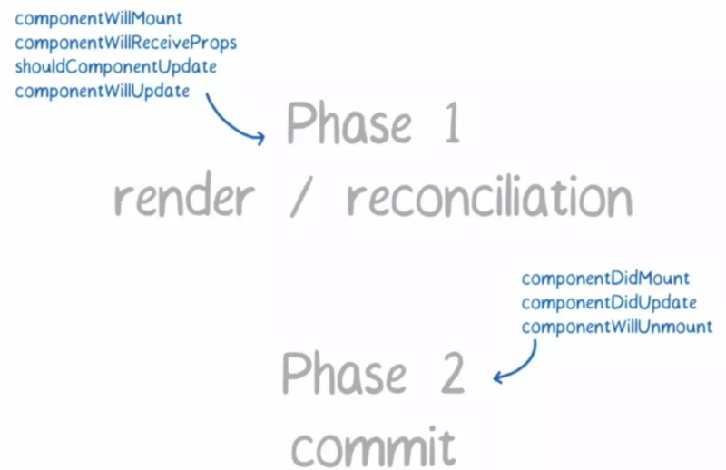

- [1. Fiber](#1-fiber)
  - [1.1. React 15 的问题](#11-react-15-的问题)
  - [1.2. 解决思路](#12-解决思路)
  - [1.3. React Fiber](#13-react-fiber)

## 1. Fiber
### 1.1. React 15 的问题
在页面元素很多，且需要频繁刷新的场景下，React 15 会出现掉帧的现象。

其根本原因，是大量的同步计算任务阻塞了浏览器的 UI 渲染。默认情况下，JS 运算、页面布局和页面绘制都是运行在浏览器的主线程当中，他们之间是互斥的关系。如果 JS 运算持续占用主线程，页面就没法得到及时的更新。
当我们调用`setState`更新页面的时候，React 会遍历应用的所有节点，计算出差异，然后再更新 UI。整个过程是一气呵成，不能被打断的。如果页面元素很多，整个过程占用的时机就可能超过 16 毫秒，就容易出现掉帧的现象。

### 1.2. 解决思路
解决主线程长时间被 JS 运算占用这一问题的基本思路，是将运算切割为多个步骤，分批完成。也就是说在完成一部分任务之后，将控制权交回给浏览器，让浏览器有时间进行页面的渲染。等浏览器忙完之后，再继续之前未完成的任务。


旧版 React 通过递归的方式进行渲染，使用的是 JS 引擎自身的函数调用栈，它会一直执行到栈空为止。而`Fiber`实现了自己的组件调用栈，它以**链表**的形式遍历组件树，可以灵活的暂停、继续和丢弃执行的任务。实现方式是使用了浏览器的`requestIdleCallback`这一 API。

>window.requestIdleCallback()会在浏览器空闲时期依次调用函数，这就可以让开发者在主事件循环中执行后台或低优先级的任务，而且不会对像动画和用户交互这些延迟触发但关键的事件产生影响。函数一般会按先进先调用的顺序执行，除非函数在浏览器调用它之前就到了它的超时时间。

### 1.3. React Fiber
React 框架内部的运作可以分为 3 层：
- Virtual DOM 层，描述页面长什么样。
- Reconciler 层，负责调用组件生命周期方法，进行 Diff 运算等。
- Renderer 层，根据不同的平台，渲染出相应的页面，比较常见的是 ReactDOM 和 ReactNative。

这次改动最大的当属 Reconciler 层了，React 团队也给它起了个新的名字，叫`Fiber Reconciler`。这就引入另一个关键词：Fiber。
Fiber 其实指的是一种数据结构，它可以用一个纯 JS 对象来表示：
```js
const fiber = {
    stateNode,    // 节点实例
    child,        // 子节点
    sibling,      // 兄弟节点
    return,       // 父节点
}
```
为了加以区分，以前的 Reconciler 被命名为`Stack Reconciler`。Stack Reconciler 运作的过程是不能被打断的，必须一条道走到黑。

而 Fiber Reconciler 每执行一段时间，都会将控制权交回给浏览器，可以分段执行。
为了达到这种效果，就需要有一个调度器 (Scheduler) 来进行任务分配。任务的优先级有六种：
- synchronous，与之前的Stack Reconciler操作一样，同步执行
- task，在next tick之前执行
- animation，下一帧之前执行
- high，在不久的将来立即执行
- low，稍微延迟执行也没关系
- offscreen，下一次render时或scroll时才执行

优先级高的任务（如键盘输入）可以打断优先级低的任务（如Diff）的执行，从而更快的生效。
Fiber Reconciler 在执行过程中，会分为 2 个阶段。


1. 阶段一，生成 Fiber 树，得出需要更新的节点信息。这一步是一个渐进的过程，可以被打断。
2. 阶段二，将需要更新的节点一次过批量更新，这个过程不能被打断。


本质上，从`Stack Reconciler`到`Fiber Reconciler`，源码层面其实就是干了一件递归改循环的事情

