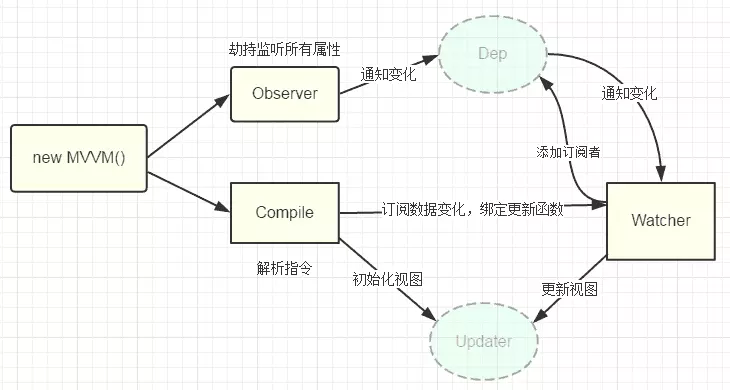

### 1. 双向数据绑定的原理
vue数据双向绑定是通过数据劫持结合发布者-订阅者模式的方式来实现的。

1. 要实现数据的双向绑定，首先要对数据进行劫持监听，所以我们需要设置一个监听器Observer，用来监听所有属性。
2. 如果属性发上变化了，就需要告诉订阅者Watcher看是否需要更新。
3. 因为订阅者是有很多个，所以我们需要有一个消息订阅器Dep来专门收集这些订阅者，然后在监听器Observer和订阅者Watcher之间进行统一管理的。
4. 接着，我们还需要有一个指令解析器Compile，对每个节点元素进行扫描和解析，将相关指令（如v-model，v-on）对应初始化成一个订阅者Watcher，并替换模板数据或者绑定相应的函数，此时当订阅者Watcher接收到相应属性的变化，就会执行对应的更新函数，从而更新视图。

因此接下去我们执行以下3个步骤，实现数据的双向绑定：

1. 实现一个监听器Observer，用来**劫持并监听所有属性**，如果有变动的，就通知订阅者。

2. 实现一个订阅者Watcher，**每一个Watcher都绑定一个更新函数**，watcher可以收到属性的变化通知并执行相应的函数，从而更新视图。

3. 实现一个解析器Compile，可以**扫描和解析每个节点的相关指令**（v-model，v-on等指令），如果节点存在v-model，v-on等指令，则解析器Compile**初始化这类节点的模板数据**，使之可以显示在视图上，然后**初始化相应的订阅者（Watcher）**。




### 2. Proxy 相比于 defineProperty 的优势
1. `Object.defineProperty`无法监控到数组下标的变化，导致直接通过数组的下标给数组设置值，不能实时响应。 为了解决这个问题，经过vue内部处理后可以使用以下几种方法来监听数组
```
push()
pop()
shift()
unshift()
splice()
sort()
reverse()
```
由于只针对了以上八种方法进行了hack处理,所以其他数组的属性也是检测不到的，还是具有一定的局限性。

2. `Object.defineProperty`只能劫持对象的属性,因此我们需要对每个对象的每个属性进行遍历。Vue 2.x里，是通过 `递归 + 遍历` data 对象来实现对数据的监控的，如果属性值也是对象那么需要深度遍历,显然如果能劫持一个完整的对象是才是更好的选择。
而要取代它的Proxy有以下两个优点;
    - 可以劫持整个对象，并返回一个新对象
    - 有13种劫持操作


