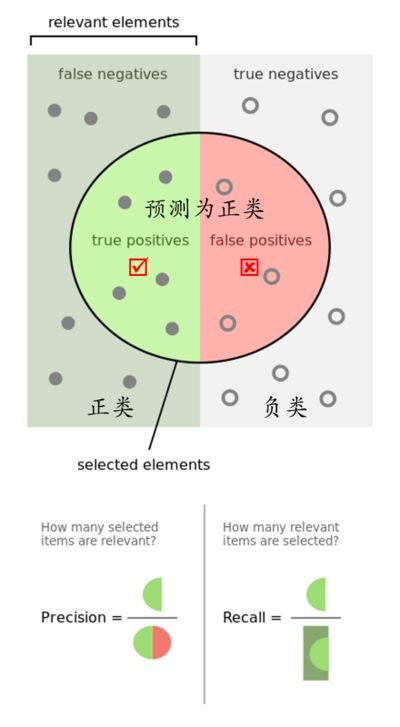

- [1. 深度学习入门](#1-深度学习入门)
  - [1.1. 分类及其性能度量](#11-分类及其性能度量)
    - [1.1.1. 分类准确率](#111-分类准确率)
    - [1.1.2. 精确率`precision`和召回率`recall`，更关注正类](#112-精确率precision和召回率recall更关注正类)
  - [1.2. 特征工程](#12-特征工程)
  - [1.3. 机器学习和数据挖掘的区别？](#13-机器学习和数据挖掘的区别)
  - [1.4. 训练集和测试集的划分方法](#14-训练集和测试集的划分方法)
  - [1.5. 机器学习分类](#15-机器学习分类)
    - [1.5.1. 回归和分类的区别和联系](#151-回归和分类的区别和联系)
  - [1.6. 特征提取的重要性](#16-特征提取的重要性)

## 1. 深度学习入门

### 1.1. 分类及其性能度量
通常将关注的类称为正类。

|      |        | 预测                |                     |
| ---- | ------ | ------------------- | ------------------- |
|      |        | 正样本              | 负样本              |
| 实际 | 正样本 | True Positive (TP)  | False Negative (FN) |
|      | 负样本 | False Positive (FP) | True Negative (TN)  |


```
预测类别          正例   负例   总计
实际类别　　正例    TP    FN     P(实际为正)
　　　　　　负例    FP    TN     N(实际为负)
```


#### 1.1.1. 分类准确率

`accuraty：(TP + TN)/(P+N)`

弊端：100条短信中，只有1条是垃圾短信，将其都归为非垃圾短信，准确率为99%，显然不合适。

#### 1.1.2. 精确率`precision`和召回率`recall`，更关注正类

`precision = TP/(TP + FP)`，指模型判定的正例中真正正例的比例。比如预测出的垃圾短信中真正垃圾短信的比例。

`recall = TP/(TP+FN) = TP/P`，指总正例中被模型正确判定正例的比重。医学上称为灵敏度(`sensitivity`)。比如所有真的垃圾短信被正确找出来的比例。

**查准率：精确率；**
**查全率：召回率。**

精确率和召回率的关系：**撒网打鱼，如果网很大，打上来的鱼很多，召回率很大，但也会打上很多石头，精确率就会比较低。**

PR曲线`(x-R, y-P)`下的面积，`Area Under Curve`, 简称AUC 

Area有助于弥补P、R的单点值局限性，可以反映全局性能。


### 1.2. 特征工程
当你做特征工程时，其实是**将数据属性转换为数据特征**的过程。

属性代表了数据的所有维度，在数据建模时，如果对原始数据的所有属性进行学习，并不能很好的找到数据的潜在趋势。
而通过特征工程对你的数据进行预处理的话，你的算法模型能够减少受到噪声的干扰，这样能够更好的找出趋势；

**数据和特征决定了机器学习的上限，而模型和算法只是逼近这个上限而已**。

比如词根提取和词形还原等。

### 1.3. 机器学习和数据挖掘的区别？
数据挖掘偏应用，机器学习偏理论；数据挖掘是利用机器学习的技术，加上数据库知识，挖掘海量信息。

分类器三步：训练阶段、测试阶段、工作阶段


### 1.4. 训练集和测试集的划分方法

- 留出法（留出一部分测试）
- 交叉验证法（分层取样）
- 自助法（有放回的取样本）


### 1.5. 机器学习分类

根据任务是**预测标签还是预测最后的结果**，将机器学习分为强化学习(`reinforcement learning`)和（有监督、无监督、半监督）。
- 比如说，下棋不关心每一步对或错，只关心最后赢或输，又比如自动驾驶，不关心每一步向左或向右，关心的是到达终点的用时。

有监督、无监督的区别是训练时有无label，有监督又可分为分类和回归，其区别是label是离散还是连续。
- 判断两张人脸是否属于同一个人、性别预测等属于分类问题，年龄预测、股票走势预测是回归问题。
- 分类和回归没有明确的界限，比如年龄预测，比如只算到实数，1-100岁，就是多分类问题。

#### 1.5.1. 回归和分类的区别和联系
区别：分类是推断输入x的**离散类别**（如+1，-1）；回归是推断输入x对应的输出值，为**连续实数**。

联系：可以利用回归模型进行分类，即**将回归模型的输出离散化以进行分类**；也可以利用分类模型进行回归。

### 1.6. 特征提取的重要性
**特征提取比机器学习算法重要的多得多**，好的、显著的特征任何算法都有不错的结果，而区别不明显的特征任何算法差别不大。而对于声音、图像等提取特征的方法千差万别，针对测井曲线也是一样。


