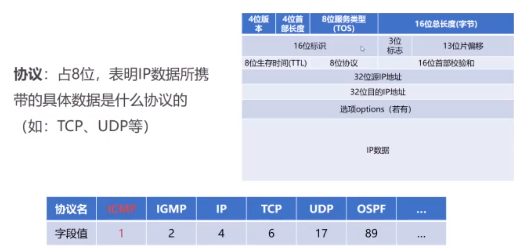
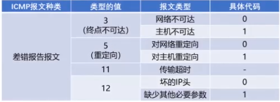

- [1. ICMP协议](#1-icmp协议)
  - [1.1. ICMP协议详解](#11-icmp协议详解)
  - [1.2. ICMP协议的应用](#12-icmp协议的应用)
  
  
## 1. ICMP协议

### 1.1. ICMP协议详解

网际控制报文协议（`Internet Control Message Protocol`）
- [ ] 可以**报告错误信息或者异常情况**
- [ ] 辅助IP协议

 

ICMP协议报文首部：
1. 类型
2. 代码
3. 校验和
  

 

ICMP报文封装**在IP报文里面传输**，并且在IP报文首部的**协议字段填充字段值为1**，代表**ICMP**：
 
 

ICMP两种类型：
- [ ] 差错报告报文
- [ ] 询问报文

差错报告报文，类型和具体代码：
 
 

询问报文，验证网络是否互通或者对时间同步：
 
 

### 1.2. ICMP协议的应用

Ping应用
- [ ] 使用询问报文中的第一种，即回送请求（`Echo`）或应答

网络故障排除过程：
- [ ] Ping回环地址`127.0.0.1`，如果失败说明协议栈出错，重装系统？
- [ ] Ping 网关地址，内网的话一般为`192.168.0.1`或`192.168.1.1`，通的话说明本机到路由器是通的，不通的话说明网线或者wifi有问题
- [ ] Ping远端地址

`Traceroute`应用
- [ ] 探测IP数据包在网络中走过的路径

`Traceroute`原理：
利用`TTL`和`ICMP`终点不可达差错报文，从`TTL=1`开始，每次加1，通过返回的不可达的`ICMP`报文，就可以获取经过的设备的IP地址，直到到达了目的机器

使用方法： `tracert IP/域名`
