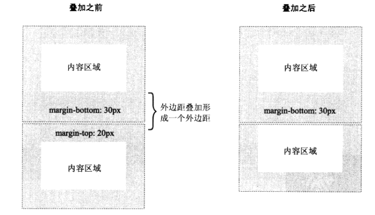
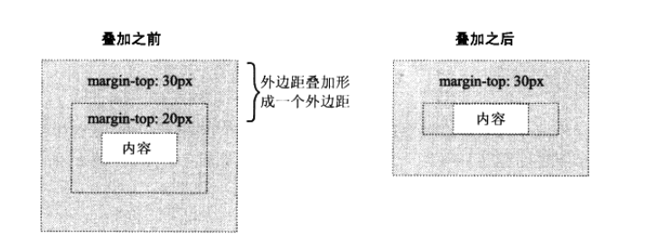

- [1. 浮动、BFC](#1-浮动bfc)
  - [1.1. BFC及其作用](#11-bfc及其作用)
  - [1.2. 哪些元素会生成BFC？](#12-哪些元素会生成bfc)
  - [1.3. 双边距重叠问题（外边距折叠）](#13-双边距重叠问题外边距折叠)
  - [1.4. margin 叠加几种情况](#14-margin-叠加几种情况)
  - [1.5. 为什么会出现浮动？什么时候需要清除浮动？](#15-为什么会出现浮动什么时候需要清除浮动)
  - [1.6. 清除浮动的方式](#16-清除浮动的方式)
  - [1.7. overflow 清除浮动的原理](#17-overflow-清除浮动的原理)
  - [1.8. `zoom:1`的常见作用](#18-zoom1的常见作用)

## 1. 浮动、BFC

### 1.1. BFC及其作用

BFC( block formatting context ）：简单来说，BFC 就是一种属性，这种属性会影响着元素的定位以及与其兄弟元素之间的相互作用。 

中文常译为**块级格式化上下文**。是 W3C CSS 2.1 规范中的一个概念，它决定了元素如何对其内容进行定位，以及与其他元素的关系和相互作用。 
在进行盒子元素布局的时候，BFC提供了一个环境，在这个环境中按照一定规则进行布局不会影响到其它环境中的布局。比如浮动元素会形成BFC，浮动元素内部子元素的主要受该浮动元素影响，两个浮动元素之间是互不影响的。
也就是说，**如果一个元素符合了成为BFC的条件，该元素内部元素的布局和定位就和外部元素互不影响(除非内部的盒子建立了新的 BFC)**，是一个隔离了的独立容器。（在 CSS3 中，BFC 叫做 Flow Root）

BFC（块级格式化上下文，用于**清除浮动，防止margin重叠**等）
- 直译成：块级格式化上下文，是一个**独立的渲染区域，并且有一定的布局规则**。
- BFC区域不会与float box重叠
- BFC是页面上的一个独立容器，**子元素不会影响到外面**
- 计算BFC的高度时，浮动元素也会参与计算

### 1.2. 哪些元素会生成BFC？

1. 根元素
2. `float`不为`none`的元素
3. `position`为`fixed`和`absolute`的元素
4. `display`为`inline-block`、`table-cell`、`table-caption`，`flex`，`inline-flex`的元素
5. `overflow`不为`visible`的元素

### 1.3. 双边距重叠问题（外边距折叠）

多个相邻（兄弟或者父子关系）普通流的块元素垂直方向`marigin`会重叠。

折叠的结果为：
- 两个相邻的外边距都是**正数**时，折叠结果是它们两者之间**较大的值**。
- 两个相邻的外边距都是**负数**时，折叠结果是两者**绝对值的较大值**。
- 两个外边距**一正一负**时，折叠结果是两者的**相加**的和。

### 1.4. margin 叠加几种情况

margin 叠加的意思是：当两个或者更多的垂直外边距 相遇时，它们将形成一个外边距，这个外边距的高度等于两个发生叠加的外边距中高度较大者。

1. 当一个元素出现在另一个元素上面时，第一个元素的底边外边距与第二个元素的顶边外边距发生叠加。如图： 
2. 当一个元素在另一个元素中时，它们的顶边距和底边距也会发生叠加  
3. 如果一个元素是空元素（即一个元素没有内容，内边距和边框），这种情况外边距的顶边距和底边距碰在一起也会发生叠加  
4. 在上面那种空元素的情况，如果该空元素与另一个元素的外边距碰在一起，也会发生叠加。 
  
以上 4 种外边距叠加情况**只会发生在普通文档流的垂直方向**。行内框、浮动框、绝对定位框之间的外边距不会发生叠加，同样水平方向也不会发生叠加。

### 1.5. 为什么会出现浮动？什么时候需要清除浮动？

浮动元素碰到包含它的边框或者浮动元素的边框停留。由于浮动元素不在文档流中，所以文档流的块框表现得就像浮动框不存在一样。浮动元素会漂浮在文档流的块框上。

浮动带来的问题：
1. 父元素的高度无法被撑开，影响与父元素同级的元素
2. 与浮动元素同级的非浮动元素（内联元素）会跟随其后
3. 若非第一个元素浮动，则该元素之前的元素也需要浮动，否则会影响页面显示的结构。

### 1.6. 清除浮动的方式

1. 父级div定义`height`
2. 最后一个浮动元素后加空div标签 并添加样式`clear:both`。
3. 包含浮动元素的父标签添加样式`overflow为hidden或auto`。
4. 父级div定义`zoom`

### 1.7. overflow 清除浮动的原理

要讲清楚这个解决方案的原理，首先需要了解块格式化上下文，块格式化上下文是CSS可视化渲染的一部分，它是一块区域，规定了内部块盒 的渲染方式，以及浮动相互之间的影响关系

当元素设置了overflow样式且值不为visible时，该元素就**构建了一个BFC，BFC在计算高度时，内部浮动元素的高度也要计算在内**，也就是说BFC区域内只有一个浮动元素，BFC的高度也不会发生塌缩，所以达到了清除浮动的目的。

### 1.8. `zoom:1`的常见作用

设置`zoom:1`可以在`IE6下`清除浮动、解决margin导致的重叠等问题。

通常，当浮动子元素导致父元素塌陷的时候，只要给父元素加上`overflow: hidden;`来解决，但是对于IE不行，需要触发其`hasLayout`属性才可以。

`zoom:1`就是`IE6`专用的触发 `haslayout`属性的。`hasLayout`是IE特有的一个属性。很多的IE下的css bug都与其息息相关。在IE中，一个元素要么自己对自身的内容进行计算大小和组织，要么依赖于父元素来计算尺寸和组织内容。当一个元素的`hasLayout`属性值为true时，它负责对自己和可能的子孙元素进行尺寸计算和定位。

