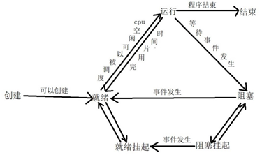

- [1. 关于Linux](#1-关于linux)
- [2. 开源软件简介](#2-开源软件简介)
- [3. Linux的使用用途](#3-linux的使用用途)
- [4. Linux 和 Windows 的不同](#4-linux-和-windows-的不同)
- [5. 字符界面的优势](#5-字符界面的优势)
- [6. 常见目录作用](#6-常见目录作用)
  - [6.1. etc](#61-etc)
  - [6.2. opt](#62-opt)
- [7. 文件处理命令](#7-文件处理命令)
- [8. 软连接和硬链接的区别？（ln指令）](#8-软连接和硬链接的区别ln指令)
- [9. Bash 命令生效顺序](#9-bash-命令生效顺序)
- [10. Linux中单引号和双引号区别？](#10-linux中单引号和双引号区别)
- [11. history 历史命令](#11-history-历史命令)
- [12. 硬盘分区和格式化概述](#12-硬盘分区和格式化概述)
- [13. 在 VM 虚拟机中添加硬盘](#13-在-vm-虚拟机中添加硬盘)
- [14. 硬盘分区工具 `fdisk`命令](#14-硬盘分区工具-fdisk命令)
- [15. MBR分区模式和GPT分区模式](#15-mbr分区模式和gpt分区模式)
- [16. 32位和64位系统](#16-32位和64位系统)
- [17. 基础](#17-基础)
- [18. 挂起状态](#18-挂起状态)
- [19. 僵尸进程与孤儿进程](#19-僵尸进程与孤儿进程)
- [20. 系统资源查看](#20-系统资源查看)
  - [20.1. vmstat命令监控系统资源（`memory`, `swap`, `system`, `io`, `cpu`等）](#201-vmstat命令监控系统资源memory-swap-system-io-cpu等)
  - [20.2. dmesg开机时内核检测信息（判断硬件状态）](#202-dmesg开机时内核检测信息判断硬件状态)
  - [20.3. 3.free命令查看内存使用状态](#203-3free命令查看内存使用状态)
  - [20.4. 查看cpu信息](#204-查看cpu信息)
  - [20.5. uptime 与 w命令](#205-uptime-与-w命令)
  - [20.6. 6.查看系统与内核相关信息（内核版）](#206-6查看系统与内核相关信息内核版)
  - [20.7. 如何判断系统是32位还是64位？](#207-如何判断系统是32位还是64位)
  - [20.8. 查看发行版信息](#208-查看发行版信息)
  - [20.9. 列出进程打开或使用的文件信息](#209-列出进程打开或使用的文件信息)
  - [20.10. file指令](#2010-file指令)
- [21. Linux常用命令英文全称与中文解释](#21-linux常用命令英文全称与中文解释)

### 1. 关于Linux
Linux简介
1.	Linux前身：Minix，由Andrew S. Tanenbaum教授参考Unix编写
2.	Linux创始人：Linus Torvalds
3.	Linux内核版（只有内核）和发行版（在内核的基础上,加入用户界面,各种软件的支持等定制）
4.	“内核”指的是一个提供硬件抽象层、磁盘及文件系统控制、多任务等功能的系统软件。
5.	一个内核不是一套完整的操作系统。
6.	Linux内核的主要模块（或组件）分以下几个部分：存储管理、CPU和进程管理、文件系统、设备管理和驱动、网络通信，以及系统的初始化（引导）、系统调用等。
7.	Linux内核官网：`www.kernel.org`
8.	内核版本说明：2.6.18（18是末版本,6是次版本，2主版本）最新版本是3.16
9.	常见发行版
  - redhat常用作服务器，售后收费（服务器要求稳定和安全）；
  - centos免费（与redhat几乎完全一样），RedHat收购了centos；
  - fedora是redhat公司的个人版本，功能强大，但不稳定，图形界面好；
  - ubuntu 图形界面好。


### 2. 开源软件简介
开源软件是什么？
1. 呈现出来就是源代码。即不是二进制，而是完全英文。
2. 开源软件要保持其开源的持续。

linux与开源软件的关系：linux最大特点是开源软件

linux系统中常见开源软件：（服务器角度讲软件质量好又多）
 - 阿帕奇（羽毛；常见网站搭建软件：发布网页）；
 - nginx（占用服务器的空间少，支持更多的访问量）；
 - mysql，php，常与阿帕奇等组合网页构建平台；
 - mongoDB；samba；ruby；等


### 3. Linux的使用用途
1. 基于linux企业服务器
（`www.netcraft.com` 可以查看各大网站的后台数据以及各大开源软件的比例变化）
2. 嵌入式
(`quickSSHd` APP软件方便用电脑操控安卓手机）
3. 机顶盒
小米盒子，乐视盒子等等


遇到问题，先尝试自己解决，其次提问时问题详尽。


### 4. Linux 和 Windows 的不同
1. Linux严格区分大小写；
2. Linux中所有内容以文件形式保存，包括硬件，包括用户。    
    - 一切内容皆文件
3. Linux **不靠扩展名**来区分文件，但也有一些约定俗成的给管理员区分的文件扩展名（也可不需要），它靠权限来区分文件；
4. Windows下的程序不能直接在 Linux 中安装和运行。


### 5. 字符界面的优势
1. 字符界面占用的系统资源少；（图形界面会占用系统资源）
2. 字符界面减少了出错和被攻击的可能性。（开的服务越多，开的软件越多，越容易出错）
    - 每天躺在床上睡了吃，吃了睡就不会犯错


### 6. 常见目录作用
linux 是个严谨的操作系统，一级目录都严格规定
  - 做练习推荐在家目录中（root或home），以及tmp。


1. bin（binary） ：常见linux命令、系统所有用户命令目录文件
2. dev（device） : 设备驱动存储目录文件
3. media: 多媒体及挂载目录
4. proc （process）：进程信息文件，直接写入内存的。该目录同sys目录不能直接操作，这两个目录保存的是内存的挂载点。其中的数据直接写在内存中。避免数据丢失或由于内存溢出导致系统崩溃。
5. sbin（super user binary） : root用户命令文件
6. var （variable）: 变量文件，系统相关文档内容
7. boot: 引导程序文件
8. etc （etcetera）: 所有程序所需要的配置文件
9. lib （library）: 系统默认库路径文件
10. mnt （mount）: 挂载目录，系统挂载U盘、移动硬盘目录(空目录)
11. root : root根目录
12. tmp （temporary）: 临时文件目录
13. home: 家目录（用户目录）
14. opt （option）: 可选目录（可以选择安装应用程序的目录）
15. usr （Unix System Resource）: Unix系统资源
16. misc 外接磁带机挂载目录

根目录下的 bin 和 sbin，usr 目录下的 bin 和 sbin，这四个目录都是用来保存系统命令。其中，bin 目录下的命令任何用户都可以执行，sbin 目录下只有 root 才可以执行。linux 使用此方式来区分用户权限。


#### 6.1. etc
1. 初期：早期UNIX中，贝尔实验室的解释是：etcetra directory 。 etc. 就是Etcetra。表示其他、等等什么的，英语里能常常看都这个缩写的。是用来放其他不能归类到其他目录中的内容。
2. 后来FHS规定用来放配置文件，就解释为："Editable Text Configuration" 或者 "Extended Tool Chest"。


#### 6.2. opt
- Optional application software packages
- optional 的前三个字母


### 7. 文件处理命令
文件权限：
1. 读取权限：浏览文件/目录中内容的权限；
2. 写入权限：
    - 对文件而言是修改文件内容的权限
    - 对目录而言是删除、添加和重命名目录内文件的权限；
3. 执行权限：
   - 对可执行文件而言是允许执行的权限
   - 对目录而言是进入目录的权限。


文件用户分类
1.	文件所有者：建立文件和目录的用户；
2.	文件所有者所在组用户：文件所有者所属用户组中的其他用户；
3.	其他用户：既不是文件所有者，又不是文件所有组所在组的其他所有用户。
4.	超级用户：负责整个系统的管理和维护，拥有系统中所有文件的全部访问权限。


### 8. 软连接和硬链接的区别？（ln指令）
硬连接
1. 硬连接指通过索引节点来进行连接。在linux的文件系统中，保存在磁盘分区中的文件不论什么类型都给你分配一个编号，称为索引节点号（Inode Index）。
2. 在Linux中，多个文件名指向同一个索引节点是存在的。
3. 比如：A是B的硬连接（A和B都是文件名），则A的目录项中的Inode节点号和B的目录项中的Inode节点号相同，即一个inode节点对应两个不同的文件名，两个文件名指向同一个文件。
4. A和B对文件系统来说是完全平等的，删除其中任何一个都不会影响另一个的访问。

软连接
1. 软连接也称为符号连接（Symbolic Link），类似windows的快捷方式，实际上是一种特殊的文件。
2. 软连接中，文件实际上时一个文本文件，其中包含的有另一文件的位置信息。
3. 比如A是B的软连接（A和B都是文件名），A的目录项中的inode节点号与B的目录项中的inode节点号不相同，A和B指向两个不同的inode，继而指向两个不同的数据块。但是A的数据块中存放的只是B的路径名（可以根据这个找到B的目录项）。
4. A和B之间是主从关系，如果B被删除了，A仍然存在（因为两个是不同的文件），但指向的是一个无效的链接。


### 9. Bash 命令生效顺序
1. 第一顺位执行绝对路径或者相对路径的命令
2. 第二顺位执行别名
3. 第三顺位执行 Bash 的内部命令
4. 第四顺位执行按照`$PATH`环境变量设置定义的目录顺序的第一个命令

### 10. Linux中单引号和双引号区别？
1. 都是为了解决中间有空格的问题
2. 他们的区别在于，单引号将剥夺其中的所有字符的特殊含义，而双引号中的`'$'`（参数替换）和`'\'`（命令替换）是例外。
3. 反引号和`$()`是一样的。在执行一条命令时，会先将其中的 ` `` `，或者是`$()` 中的语句当作命令执行一遍，再将结果加入到原命令中重新执行


### 11. history 历史命令
```
history [选项] [历史命令保存文件]
```
- -c 清空历史命令
- -w 把缓存中的历史命令写入历史命令保存文件 `~/.bash_history`  （本来是等系统退出的时候再写入这个文件，现在-w就不用退出了）
```
# 默认保存1000条
HISTSIZE=1000
```
环境变量配置文件(除了家目录下的`.bashrc`外的另一个环境变量配置文件)，比如增加保存历史命令条数
```
$ vi /etc/profile 
```

基本调用
- 上下箭头来重复调用
- `!n` 来执行第n条历史命令
- `!!` 重复执行上一条命令
- `!字符串` 重复执行后一个该串开头的命令


### 12. 硬盘分区和格式化概述
1. 第一 主分区和扩展分区总数不能超过4个 
2. 第二 扩展分区最多只能有一个 
3. 第三 扩展分区不能直接存取数据 

非图形界面的生产环境下，硬盘空间用尽：应在保留原硬盘的基础上，给服务器添加新的硬盘


### 13. 在 VM 虚拟机中添加硬盘
1. 服务器添加新硬盘：
    - 添加硬盘要关闭系统（关机）
    - 有些服务器的主板支持热插拔（即：不关闭服务器的情况下，连接新的硬件）
2. 虚拟机添加新硬盘：
    - 虚拟机不支持热插拔
    - 关机-->添加硬盘-->确定开机


### 14. 硬盘分区工具 `fdisk`命令 
`fdisk -l`  查看分区情况


Linux 中硬件设备都是以文件的形式存在于根目录的 dev 目录下的
硬件设备都是由 linux 系统自动识别的（开机后自动识别）

必须对硬盘进行**分区，格式化，挂载**后才能使用（存取数据）

1. 虚拟机或者实机关机，加 disk 后打开电源
2. fdisk 分区命令
```
fdisk -l 列出当前系统的分区表 
```
3. fdisk /dev/sdb  进入分区模式
    - -m 查看该模式下参数的帮助信息
    - -n 添加一个新的分区
      #输入n 后系统提示再输入选项：
      - p：主分区   primary
      - e:扩展分区  extended
      - l:逻辑分区
  - -p 查看设定的分区信息
  - -d  删除分区
  - -w  把分区信息写入系统的分区表

4. 分区编号：1-4 留给主分区扩展分区用的 ，最多只能有1个扩展分区
5. 逻辑分区可以有多个，逻辑分区是从扩展分区里分出来的，如果删除扩展分区，逻辑分区同时也会被删除


### 15. MBR分区模式和GPT分区模式
MBR分区模式:
1. 主分区不超过4个（所以用扩展分区来解决）
2. 单个分区容量最大2TB
3. 分区命令`fdisk /dev/sdxx`
4. 分区完毕，执行`-w` 写入分区表才能生效
5. 分区表类型是：`msdos`

缺点：限制多，跟不上发展

GPT分区模式：
1. 主分区个数"几乎"没有限制（最多128个）
2. 单个分区容量"几乎"没有限制(最大18EB)
3. 使用`parted`命令工具（同时支持 MBR, GPT 分区）
4. 分区表类型是：`gpt`

缺点：GPT主分区中不适合安装`x86`的系统架构

### 16. 32位和64位系统
- 这个32位和64位主要说的是CPU一次处理数据的能力，32 位就是`32bit`，即一次可以处理 4 个字节的数据；
- 64位就是`64bit`，即一次可以处理 8 个字节。
- 64位的 CPU 既可以安装 64 位系统，也可以安装 32 位系统，性能都可以达到最高；
- 而32位的CPU可以安装32位系统，虽然也可以安装64位系统，但是性能永远不能提高到64位的系统，
- 64位的CPU可以支持到 128GB 的内存；
- 而32位的CPU最高只能支持 4GB 内存。


装32位系统还是64位系统？
- 看内存大小，内存有4GB及以上的就装64位系统，4GB以下的内存都装32位系统。


### 17. 基础
`[root@ygw ~]#` root代表当前登录用户，ygw 代表主机名，~代表当前所在目录（家目录），

`#` 代表超级用户的提示符， 普通用户的提示符是`$`

超级用户，家在`/root/`下，普通用户，家在`/home/user1/`下


### 18. 挂起状态

- 程序运行必须加载在内存中，当有过多的就绪态或阻塞态进程在内存中没有运行，因为内存很小，有可能不足。系统需要把他们移动到内存外磁盘中，称为挂起状态。
- 就绪状态的进程挂起就是挂起就绪状态;
- 阻塞进程挂起就称为阻塞挂起状态。



### 19. 僵尸进程与孤儿进程
什么称为僵尸进程呢？
- 即**子进程先于父进程退出**后，子进程的PCB需要其父进程释放，但是父进程没有处理子进程的退出状态，**父进程并没有释放子进程的PCB**，这样的子进程就称为僵尸进程，僵尸进程实际上是一个已经死掉的进程。
- 僵尸进程放弃了几乎所有的内存空间，没有任何可执行代码，也不能被调度，仅仅在进程列表中保持一个位置，记载该进程的退出状态等信息。
- 如果父进程能及时处理，可能用ps命令就来不及看到子进程的僵尸状态(`defunct`)，但这并不等于子进程不经过僵尸状态。


孤儿进程
- **一个父进程退出，而它的一个或多个子进程还在运行**，那么那些子进程将成为孤儿进程。孤儿进程将被`init`进程(进程号为`1`)所收养，并由`init`进程对它们完成状态收集工作。
- 子进程死亡需要父进程来处理，那么意味着正常的进程应该是子进程先于父进程死亡。当父进程先于子进程死亡时，子进程死亡时没父进程处理，这个死亡的子进程就是孤儿进程。
- 孤儿进程无害，僵尸进程有害


僵尸进程处理方式：
- 将其父进程杀死，那么它的子进程，即僵尸进程会变成孤儿进程，由系统来回收。


如何避免僵尸进程产生
- 父进程先退出
- 父进程处理子进程退出状态


### 20. 系统资源查看
#### 20.1. vmstat命令监控系统资源（`memory`, `swap`, `system`, `io`, `cpu`等）
```
vmstat[刷新延时 刷新次数]
```
例：
```
vmstat 1 3
```


#### 20.2. dmesg开机时内核检测信息（判断硬件状态）
```
dmesg | grep cpu 
#查看内存缓存swap使用情况
```

#### 20.3. 3.free命令查看内存使用状态
```
free [-m][-g]
```
- -b  以byte为单位
- -k  以kb为单位显示，默认
- -m :以MB为单位显示
- -g :以GB为单位显示（不满1g时显示精度丢失）

#### 20.4. 查看cpu信息
```
$  cat /proc/cpuinfo
```

#### 20.5. uptime 与 w命令

- 显示系统的系统时间，平均负载，当前登录用户数
- 即top命令的第一行（top命令耗费资源）
- w命令侧重用户信息的显示，显示了终端号ip，平均负载等

#### 20.6. 6.查看系统与内核相关信息（内核版）
```
uname [选项]
```
选项：
- -a :查看系统所有相关信息
- -r :查看内核版本
- -s :查看内核名称

#### 20.7. 如何判断系统是32位还是64位？
`file /bin/ls` （随便找一个外部命令，看它是32位的命令还是64位的命令）
注：64位cpu仍可以安装32位系统，不能通过cpu位数来判断

#### 20.8. 查看发行版信息
```
lsb_release -a
#查看发行版信息
```

#### 20.9. 列出进程打开或使用的文件信息
```
lsof [选项]
# 列出进程调用或打开的文件信息
```
选项：
- -c 字符串 ：只列出以字符串开头的进程打开文件
- -u 用户名 ：只列出某个用户的进程打开的文件
- -p pid    : 列出某个pid进程打开的文件

示例：
```
$ lsof | more
# 查询所有进程-分屏显示

$ lsof /sbin/init
# 查询/sbin/init文件被哪个文件调用（只能查系统文件，其他自己建立的文件查没有意义）

$ lsof -c httpd 
# 查看httpd进程调用了哪个文件

$ lsof -u root
# 按照用户名，查询某用户的进程所调用的文件名（数量可能很多）
```


#### 20.10. file指令
辨识该文件的类型
```
$ file -i install.log  # 显示MIME类别
install.log: text/plain; charset=utf-8
```


### 21. Linux常用命令英文全称与中文解释
[Linux常用命令英文全称与中文解释](https://blog.csdn.net/qq_40334837/article/details/83819735)