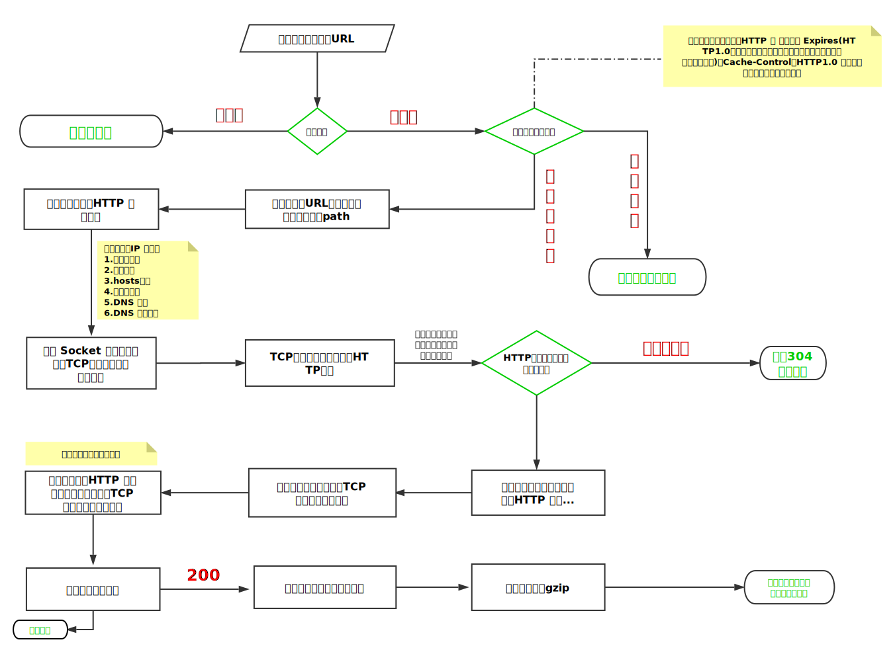
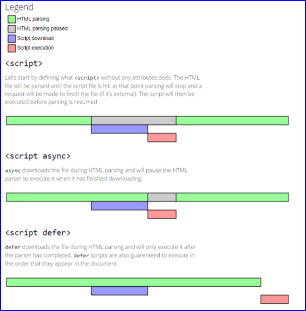

### 介绍一下标准的CSS的盒子模型？与低版本IE的盒子模型有什么不同？

1. 标准盒子模型：宽度=内容的宽度（content）+ border + padding + margin
2. 低版本IE盒子模型：宽度=内容宽度（content+border+padding）+ margin

标准盒子模型：


IE盒子模型：


在标准的盒子模型中，`width`指`content`部分的宽度，在IE盒子模型中，`width`表示`content+padding+border`这三个部分的宽度，故这使得在计算整个盒子的宽度时存在着差异：

1. 标准盒子模型的盒子宽度：`左右border+左右padding+width`
2. IE盒子模型的盒子宽度：`width`


#### `box-sizing`的属性

1. 用来控制元素的盒子模型的解析模式，默认为content-box。
2. `context-box`：W3C的标准盒子模型，设置元素的`height/width`属性指的是`content`部分的高/宽。
3. `border-box`：IE传统盒子模型。设置元素的`height/width`属性指的是`border + padding + content`部分的高/宽。
4. `padding-box`,这个属性值的宽度包含了`左右padding+width`。
5. 也很好理解性记忆，包含什么，width就从什么开始算起。


### 从浏览器地址栏输入 url 到显示页面的步骤(以 HTTP 为例)

1. 在浏览器地址栏输入 URL
2. 浏览器查看缓存，如果请求资源在缓存中并且新鲜，跳转到转码步骤

   1. 如果资源未缓存，发起新请求
   2. 如果已缓存，检验是否足够新鲜，足够新鲜直接提供给客户端，否则与服务器进行验证。
   3. 检验新鲜通常有两个 HTTP 头进行控制`Expires`和`Cache-Control`：
      - HTTP1.0 提供 Expires，值为一个绝对时间表示缓存新鲜日期
      - HTTP1.1 增加了 Cache-Control: max-age=,值为以秒为单位的最大新鲜时间

3. 浏览器**解析 URL**获取协议，主机，端口，path
4. 浏览器**组装一个 HTTP（GET）请求报文**
5. 浏览器获取主机 ip 地址，过程如下：
   1. 浏览器缓存
   2. 本机缓存
   3. hosts 文件
   4. 路由器缓存
   5. ISP DNS 缓存
   6. DNS 递归查询（可能存在负载均衡导致每次 IP 不一样）

6. 打开一个 socket 与目标 IP 地址，端口建立 TCP 链接，三次握手如下：

   1. 客户端发送一个 TCP 的**SYN=1，Seq=X**的包到服务器端口
   2. 服务器发回**SYN=1， ACK=X+1， Seq=Y**的响应包
   3. 客户端发送**ACK=Y+1， Seq=Z**

7. TCP 链接建立后**发送 HTTP 请求**

8. 服务器接受请求并解析，将请求转发到服务程序，如虚拟主机使用 HTTP Host 头部判断请求的服务程序

9. 服务器检查**HTTP 请求头是否包含缓存验证信息**如果验证缓存新鲜，返回**304**等对应状态码

10. 处理程序读取完整请求并准备 HTTP 响应，可能需要查询数据库等操作

11. 服务器将**响应报文通过 TCP 连接发送回浏览器**

12. 浏览器接收 HTTP 响应，然后根据情况选择关闭 TCP 连接或者保留重用，关闭 TCP 连接的四次握手如下：
    1. 主动方发送**Fin=1， Ack=Z， Seq= X**报文
    2. 被动方发送**ACK=X+1， Seq=Z**报文
    3. 被动方发送**Fin=1， ACK=X， Seq=Y**报文
    4. 主动方发送**ACK=Y， Seq=X**报文

13. 浏览器检查响应状态吗：是否为 1XX，3XX， 4XX， 5XX，这些情况处理与 2XX 不同
14. 如果资源可缓存，**进行缓存**
15. 对响应进行**解码**（例如 gzip 压缩）
16. 根据资源类型决定如何处理（假设资源为 HTML 文档）
17. **解析 HTML 文档，构件 DOM 树，下载资源，构造 CSSOM 树，执行 js 脚本**，这些操作没有严格的先后顺序，以下分别解释

18. 构建 DOM 树：
    1. **Tokenizing**：根据 HTML 规范将字符流解析为标记
    2. **Lexing**：词法分析将标记转换为对象并定义属性和规则
    3. **DOM construction**：根据 HTML 标记关系将对象组成 DOM 树

19. 解析过程中遇到图片、样式表、js 文件，**启动下载**
20. 构建CSSOM 树：
    1. **Tokenizing**：字符流转换为标记流
    2. **Node**：根据标记创建节点
    3. **CSSOM**：节点创建 CSSOM 树

21. [根据 DOM 树和 CSSOM 树构建渲染树](https://developers.google.com/web/fundamentals/performance/critical-rendering-path/render-tree-construction):
    1. 从 DOM 树的根节点遍历所有**可见节点**，不可见节点包括：(1) `script`,`meta`这样本身不可见的标签。(2) 被 css 隐藏的节点，如`display: none`
    2. 对每一个可见节点，找到恰当的 CSSOM 规则并应用
    3. 发布可视节点的内容和计算样式

22. js 解析如下：
    1. 浏览器创建 Document 对象并解析 HTML，将解析到的元素和文本节点添加到文档中，此时**document.readystate 为 loading**
    2. HTML 解析器遇到**没有 async 和 defer 的 script 时**，将他们添加到文档中，然后执行行内或外部脚本。这些脚本会同步执行，并且在脚本下载和执行时解析器会暂停。这样就可以用 document.write()把文本插入到输入流中。**同步脚本经常简单定义函数和注册事件处理程序，他们可以遍历和操作 script 和他们之前的文档内容**
    3. 当解析器遇到设置了**async**属性的 script 时，开始下载脚本并继续解析文档。脚本会在它**下载完成后尽快执行**，但是**解析器不会停下来等它下载**。异步脚本**禁止使用 document.write()**，它们可以访问自己 script 和之前的文档元素
    4. 当文档完成解析，document.readState 变成 interactive
    5. 所有**defer**脚本会**按照在文档出现的顺序执行**，延迟脚本**能访问完整文档树**，禁止使用 document.write()
    6. 浏览器**在 Document 对象上触发 DOMContentLoaded 事件**
    7. 此时文档完全解析完成，浏览器可能还在等待如图片等内容加载，等这些**内容完成载入并且所有异步脚本完成载入和执行**，document.readState 变为 complete,window 触发 load 事件

23. **显示页面**（HTML 解析过程中会逐步显示页面）




### cache-control 属性有哪些？

1. cache-control: max-age=xxxx，public

客户端和代理服务器都可以缓存该资源；
客户端在xxx秒的有效期内，如果有请求该资源的需求的话就直接读取缓存,statu code:200 ，如果用户做了刷新操作，就向服务器发起http请求


2. cache-control: max-age=xxxx，private

只让客户端可以缓存该资源；代理服务器不缓存
客户端在xxx秒内直接读取缓存,statu code:200

3. cache-control: max-age=xxxx，immutable

客户端在xxx秒的有效期内，如果有请求该资源的需求的话就直接读取缓存,statu code:200 ，即使用户做了刷新操作，也不向服务器发起http请求

4. cache-control: no-cache

跳过设置强缓存，但是不妨碍设置协商缓存；一般如果你做了强缓存，只有在强缓存失效了才走协商缓存的，设置了no-cache就不会走强缓存了，每次请求都回询问服务端。


5. cache-control: no-store

不缓存，这个会让客户端、服务器都不缓存，也就没有所谓的强缓存、协商缓存了。

`Cache-Control: max-age=3600, immutable`，表明该资源能存活一小时，在一小时之内，即便用户刷新也不要发送条件请求，不走协商缓存的流程。在过期之后，浏览器会发送一个不带`If-Modified-Since`和`If-None-Match`的请求来更新资源，这里需要注意，一旦被标志成 immutable，则这个资源不可能返回 304 响应了，只有 200（Chrome 开发者工具的network里面size会显示为`from memory cache/from disk cache`。）。

 总结：immutable 为了让用户在刷新页面的时候不要去请求服务器。


参考资料：[扼杀 304，Cache-Control: immutable](https://www.cnblogs.com/ziyunfei/p/5642796.html) 

### 协商缓存触发条件
1. `Cache-Control`的值为`no-cache` （不强缓存）
2. 或者`max-age`过期了 （强缓存，但总有过期的时候）


参考资料：[强缓存和协商缓存](https://www.cnblogs.com/everlose/p/12779864.html)，[浅谈http中的Cache-Control](https://blog.csdn.net/u012375924/article/details/82806617)

### 为什么要有etag？

你可能会觉得使用`last-modified`已经足以让浏览器知道本地的缓存副本是否足够新，为什么还需要`etag`呢？HTTP1.1中etag的出现（也就是说，etag是新增的，为了解决之前只有If-Modified的缺点）主要是为了解决几个last-modified比较难解决的问题：

1. 一些文件也许会**周期性的更改**，但是他的**内容并不改变(仅仅改变的修改时间)**，这个时候我们并不希望客户端认为这个文件被修改了，而重新get；
2. 某些文件**修改非常频繁**，比如在**秒以下的时间内进行修改，(比方说1s内修改了N次)**，if-modified-since能检查到的粒度是秒级的，这种修改无法判断(或者说UNIX记录MTIME只能精确到秒)；
3. 某些**服务器不能精确的得到文件的最后修改时间**。

 

### 常见的浏览器内核比较
```
Trident：这种浏览器内核是 IE 浏览器用的内核，因为在早期 IE 占有大量的市场份额，所以这种内核比较流行，以前有很多
网页也是根据这个内核的标准来编写的，但是实际上这个内核对真正的网页标准支持不是很好。但是由于 IE 的高市场占有率，微
软也很长时间没有更新 Trident 内核，就导致了 Trident 内核和 W3C 标准脱节。还有就是 Trident 内核的大量 Bug 等
安全问题没有得到解决，加上一些专家学者公开自己认为 IE 浏览器不安全的观点，使很多用户开始转向其他浏览器。

Gecko：这是 Firefox 和 Flock 所采用的内核，这个内核的优点就是功能强大、丰富，可以支持很多复杂网页效果和浏览器扩
展接口，但是代价是也显而易见就是要消耗很多的资源，比如内存。

Presto：Opera 曾经采用的就是 Presto 内核，Presto 内核被称为公认的浏览网页速度最快的内核，这得益于它在开发时的
天生优势，在处理 JS 脚本等脚本语言时，会比其他的内核快3倍左右，缺点就是为了达到很快的速度而丢掉了一部分网页兼容性。

Webkit：Webkit 是 Safari 采用的内核，它的优点就是网页浏览速度较快，虽然不及 Presto 但是也胜于 Gecko 和 Trid
ent，缺点是对于网页代码的容错性不高，也就是说对网页代码的兼容性较低，会使一些编写不标准的网页无法正确显示。WebKit 
前身是 KDE 小组的 KHTML 引擎，可以说 WebKit 是 KHTML 的一个开源的分支。

Blink：谷歌在 Chromium Blog 上发表博客，称将与苹果的开源浏览器核心 Webkit 分道扬镳，在 Chromium 项目中研发 B
link 渲染引擎（即浏览器核心），内置于 Chrome 浏览器之中。其实 Blink 引擎就是 Webkit 的一个分支，就像 webkit 是
KHTML 的分支一样。Blink 引擎现在是谷歌公司与 Opera Software 共同研发，上面提到过的，Opera 弃用了自己的 Presto 
内核，加入 Google 阵营，跟随谷歌一起研发 Blink。
```

### 常见浏览器所用内核

```
 （1） IE 浏览器内核：Trident 内核，也是俗称的 IE 内核；

 （2） Chrome 浏览器内核：统称为 Chromium 内核或 Chrome 内核，以前是 Webkit 内核，现在是 Blink内核；

 （3） Firefox 浏览器内核：Gecko 内核，俗称 Firefox 内核；

 （4） Safari 浏览器内核：Webkit 内核；

 （5） Opera 浏览器内核：最初是自己的 Presto 内核，后来加入谷歌大军，从 Webkit 又到了 Blink 内核；

 （6） 360浏览器、猎豹浏览器内核：IE + Chrome 双内核；

 （7） 搜狗、遨游、QQ 浏览器内核：Trident（兼容模式）+ Webkit（高速模式）；

 （8） 百度浏览器、世界之窗内核：IE 内核；

 （9） 2345浏览器内核：好像以前是 IE 内核，现在也是 IE + Chrome 双内核了；

 （10）UC 浏览器内核：这个众口不一，UC 说是他们自己研发的 U3 内核，但好像还是基于 Webkit 和 Trident ，还有说
      是基于火狐内核。
```

### 事件处理程序

#### DOM0 级事件处理程序
1. 先把元素取出来，然后为其属性添加一个事件的方法叫DOM0级处理程序。
2. 它是一种较传统的方式：把一个函数赋值给一个事件处理程序的属性。
3. 优点：简单，跨浏览器的优势


#### DOM2 级事件
两个方法：
1. 处理指定事件处理程序的操作：addEventListener()
2. 删除事件处理程序的操作：removeEventListener()

接收三个参数：
1. 要处理的事件名（**去掉前面的on**，比如直接写`click`或`mouseover`）
2. 作为事件处理程序的函数
3. 布尔值（**false是事件冒泡，true是事件捕获，默认false**）


注意：
1. 通过addEventListener添加的事件只能通过removeEventListener去掉
2. addEventListener可以添加多个事件。


#### IE 事件处理程序
1. attachEvent() 添加事件 （它又加上on了，即onclick等）
2. detachEvent() 删除事件
3. 接收相同的两个参数：事件处理程序的名称和事件处理程序的函数
4. **不使用第三参数**的原因：IE8 以及更早的浏览器版本**只支持事件冒泡**！


#### 事件对象
事件对象（event）：在触发 DOM 上的事件时都会产生一个对象。
DOM 中的事件对象
1. type 属性：用于获取事件类型
2. target 属性：用于获取事件目标
3. stopPropagation() 方法，阻止时间冒泡
4. preventDefault() 方法，阻止事件的默认行为（比如a标签默认跳转）


#### DOM事件级别：
- DOM0：`element.onclick=function(){}`
- DOM2：`element.addEventListener(‘click’, function(){}, false)`
- DOM3：`element.addEventListener(‘keyup, function(){}, false)`

#### DOM事件模型：
- 捕获（从上往下）
- 冒泡（从下往上）


#### 事件流三个阶段
捕获、目标阶段、冒泡


#### 描述DOM事件捕获到具体流程：
- window => document => html => body => ....=> 目标元素


#### event 对象的常见应用：
- event.preventDefault()
- event.stopPropagation()
- event.stopImmediatePropagation() 
- event.currentTarget
- event.target


### onclick 与 addEventListener 区别？
1. onclick事件在同一时间**只能指向唯一对象**。就算对于一个对象**绑定了多次**，但是仍然只会**执行最后的一次绑定**。
2. addEventListener 给一个事件**注册多个listener**
3. addEventListener 对任何DOM都是有效的，而 onclick 仅限于HTML
4. addEventListener 可以控制 listener 的触发阶段，（捕获/冒泡）。对于多个相同的事件处理器，不会重复触发，不需要手动使用 removeEventListener 清除
5. IE9使用 attachEvent 和 detachEvent


### `defer` 和 `async` 的区别


1. defer和async在网络读取（下载）这块儿是一样的，都是异步的（相较于 HTML 解析）
2. 它俩的差别在于**脚本下载完之后何时执行**，显然 defer 是最接近我们对于应用脚本加载和执行的要求的
3. 关于defer，此图未尽之处在于它是**按照加载顺序执行脚本**的，这一点要善加利用
4. async 则是一个**乱序执行**的主，反正对它来说脚本的加载和执行是紧紧挨着的，所以不管你声明的顺序如何，只要它加载完了就会立刻执行
5. 仔细想想，async 对于应用脚本的用处不大，因为它完全不考虑依赖（哪怕是最低级的顺序执行），不过它对于那些可以不依赖任何脚本或不被任何脚本依赖的脚本来说却是非常合适的，最典型的例子：`Google Analytics`


### 懒加载与预加载的基本概念

懒加载也叫延迟加载： 延迟加载图片或符合某些条件时才加载某些图片。
预加载：提前加载图片，当用户需要查看时可直接从本地缓存中渲染。


两种技术的本质：两者的行为是相反的，一个是提前加载，一个是迟缓甚至不加载。**懒加载对服务器前端有一定的缓解压力作用，预加载则会增加服务器前端压力**。

懒加载的意义及实现方式有：
意义： 懒加载的主要目的是作为服务器前端的优化，减少请求数或延迟请求数。

实现方式： 
1. 第一种是**纯粹的延迟加载**，使用`setTimeOut或setInterval`进行加载延迟.
2. 第二种是**条件加载**，符合某些条件，或触发了某些事件才开始异步下载。
3. 第三种是**可视区加载**，即仅加载用户可以看到的区域，这个主要由监控滚动条来实现，一般会在距用户看到某图片前一定距离遍开始加载，这样能保证用户拉下时正好能看到图片。

预加载的意义及实现方式有：
预加载可以说是牺牲服务器前端性能，换取更好的用户体验，这样可以使用户的操作得到最快的反映。
实现预载的方法非常多，可以用`CSS(background)、JS(Image)、HTML()`都可以。常用的是`new Image()`，设置其`src`来实现预载，再使用`onload`方法回调预载完成事件。只要浏览器把图片下载到本地，同样的src就会使用缓存，这是最基本也是最实用的预载方法。当Image下载完图片头后，会得到宽和高，因此可以在预载前得到图片的大小(方法是用记时器轮循宽高变化)。


### 浏览器内核的理解

主要分成两部分：**渲染引擎(layout engineer 或 Rendering Engine) **和** JS 引擎**。

- 渲染引擎：**负责取得网页的内容（HTML、 XML 、图像等等）、整理讯息（例如加入 CSS 等），以及计算网页的显示方式，然后会输出至显示器或打印机**。
浏览器的内核的不同对于网页的语法解释会有不同，所以渲染的效果也不相同。所有网页浏览器、电子邮件客户端以及其它需要编辑、显示网络内容的应用程序都需要内核。
- JS引擎则**解析和执行 javascript 来实现网页的动态效果**。

最开始渲染引擎和JS引擎并没有区分的很明确，后来 JS 引擎越来越独立，内核就倾向于只指渲染引擎。 


